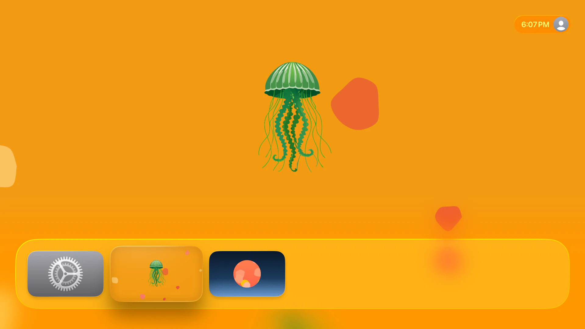
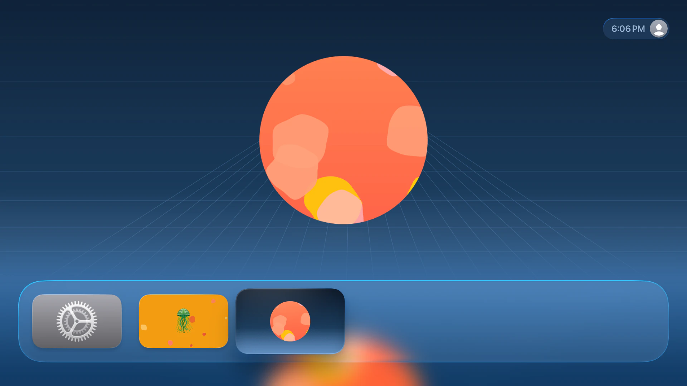
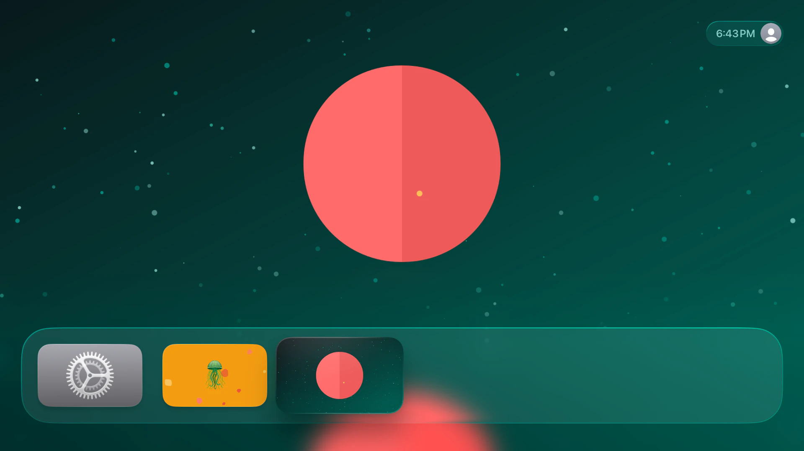

# tvos-assets

CLI tool that generates a complete tvOS `Images.xcassets` bundle from an icon and a background image. Produces all required Brand Assets (app icons with parallax layers, Top Shelf images), splash screen assets, and a standalone `icon.png` — ready to drop into an Xcode or React Native tvOS project.

<p align="center">
  
</p>

<p align="center">
  
  
</p>

## Quick Start

```bash
npx tvos-assets --icon ./icon.png --background ./bg.png --color "#F39C12"
```

Generates a timestamped zip file on your Desktop containing `Images.xcassets` and `icon.png` with all required tvOS assets. Each run produces a unique file — no overwriting.

## Install

**Global** (adds `tvos-assets` to your PATH):

```bash
npm install -g tvos-assets
```

**Run without installing** (via npx):

```bash
npx tvos-assets --icon ./icon.png --background ./bg.png --color "#F39C12"
```

**Project dependency** (e.g. for a build script):

```bash
npm install --save-dev tvos-assets
```

## Requirements

- Node.js >= 18 (this is a CLI tool — it does not run in the browser)
- [sharp](https://sharp.pixelplumbing.com/install) native dependency (installed automatically; see platform support if install fails)

## Development Setup

```bash
git clone https://github.com/keiver/tvos-assets.git
cd tvos-assets
npm install
```

## Usage

```bash
tvos-assets --icon <path> --background <path> --color <hex> [--output <path>] [--icon-border-radius <px>] [--config <path>]
```

### CLI Options

| Option | Required | Description |
|---|---|---|
| `--icon <path>` | Yes | Path to icon PNG (transparent background) |
| `--background <path>` | Yes | Path to background PNG |
| `--color <hex>` | Yes | Background color hex (e.g. `"#F39C12"`) |
| `--output <path>` | No | Output directory for the zip file. Defaults to `~/Desktop` |
| `--icon-border-radius <px>` | No | Border radius for the icon in pixels. `0` = square (default), large value = circle. |
| `--config <path>` | No | Path to a JSON config file for advanced customization |
| `--version` | No | Print version |
| `--help` | No | Show help |

CLI arguments override config file values, which override built-in defaults.

When `--output` is omitted the tool writes a timestamped zip file to `~/Desktop`. If the Desktop folder does not exist (e.g. on a Linux server) it falls back to `~`.

Each run produces a **uniquely timestamped** zip file (e.g. `tvos-assets-20260131-141523.zip`), so multiple runs never overwrite each other. The zip contains `Images.xcassets/` and `icon.png`.

## Examples

Generate to Desktop (default):

```bash
tvos-assets --icon ./icon.png --background ./bg.png --color "#F39C12"
```

Generate into a specific directory:

```bash
tvos-assets --icon ./icon.png --background ./bg.png --color "#F39C12" --output ./my-tvos-app
```

Use a config file:

```bash
tvos-assets --config ./tvos-assets.config.json
```

Config file with CLI overrides (CLI args take precedence):

```bash
tvos-assets --config ./tvos-assets.config.json --color "#00FF00" --output ./output
```

## Generated Files

The tool produces a timestamped zip file (e.g. `tvos-assets-20260131-141523.zip`) containing **39 files**: 20 `Contents.json` + 18 PNGs + `icon.png`.

```
tvos-assets-YYYYMMDD-HHmmss.zip
├── icon.png                                     (1024x1024, icon on background)
└── Images.xcassets/
    ├── Contents.json
    ├── AppIcon.brandassets/
    │   ├── Contents.json
    │   ├── App Icon.imagestack/
    │   │   ├── Contents.json
    │   │   ├── Front.imagestacklayer/
    │   │   │   ├── Contents.json
    │   │   │   └── Content.imageset/
    │   │   │       ├── Contents.json
    │   │   │       ├── front@1x.png             (400x240)
    │   │   │       └── front@2x.png             (800x480)
    │   │   ├── Middle.imagestacklayer/
    │   │   │   ├── Contents.json
    │   │   │   └── Content.imageset/
    │   │   │       ├── Contents.json
    │   │   │       ├── middle@1x.png            (400x240)
    │   │   │       └── middle@2x.png            (800x480)
    │   │   └── Back.imagestacklayer/
    │   │       ├── Contents.json
    │   │       └── Content.imageset/
    │   │           ├── Contents.json
    │   │           ├── back@1x.png              (400x240, opaque)
    │   │           └── back@2x.png              (800x480, opaque)
    │   ├── App Icon - App Store.imagestack/
    │   │   └── ... (same 3-layer structure, 1280x768 @1x)
    │   ├── Top Shelf Image.imageset/
    │   │   ├── Contents.json
    │   │   ├── top@1x.png                       (1920x720, opaque)
    │   │   └── top@2x.png                       (3840x1440, opaque)
    │   └── Top Shelf Image Wide.imageset/
    │       ├── Contents.json
    │       ├── wide@1x.png                      (2320x720, opaque)
    │       └── wide@2x.png                      (4640x1440, opaque)
    ├── SplashScreenLogo.imageset/
    │   ├── Contents.json
    │   ├── 200-icon@1x.png                      (200px)
    │   ├── 200-icon@2x.png                      (400px)
    │   ├── 200-icon@3x.png                      (600px)
    │   ├── 200-icon-tv@1x.png                   (200px, tv)
    │   └── 200-icon-tv@2x.png                   (400px, tv)
    └── SplashScreenBackground.colorset/
        └── Contents.json                        (light/dark color definitions)
```

## Input Requirements

- **Icon**: PNG with transparent background. Centered and scaled to 60% of the shorter output dimension.
- **Background**: Any PNG. Resized with cover-fit and center-cropped to each required dimension.
- **Color**: Hex format `#RRGGBB` (e.g. `#F39C12`). Used for the splash screen background colorset.

### Image Size Requirements

| Input | Minimum | Recommended | Notes |
|---|---|---|---|
| **Icon** | 1024x1024 | 1280x1280+ | Below minimum: error. Below recommended: warning (upscaling artifacts possible) |
| **Background** | 2320x720 | 4640x1440+ | Below minimum: error. Below recommended: warning (Top Shelf @2x may look blurry) |

The tool will also warn if input files exceed 50MB (high memory usage) or 8192px in any dimension.

## Brand Asset Details

### App Icon Layers (Parallax)

tvOS app icons use a 3-layer imagestack for the parallax depth effect when the user moves the Siri Remote:

| Layer | Content | Format |
|---|---|---|
| **Front** | Icon on transparent canvas | PNG with alpha |
| **Middle** | Icon on transparent canvas | PNG with alpha |
| **Back** | Background image only | Opaque PNG (no alpha) |

### Top Shelf Images

Composited images (icon centered on background), written as opaque RGB PNGs as required by tvOS.

| Asset | Size (points) | Scales |
|---|---|---|
| Top Shelf Image | 1920x720 | 1x, 2x |
| Top Shelf Image Wide | 2320x720 | 1x, 2x |

### Splash Screen

| Asset | Type | Description |
|---|---|---|
| SplashScreenLogo | Imageset | Icon on transparent background at 1x/2x/3x (universal) + 1x/2x (tv) |
| SplashScreenBackground | Colorset | Light/dark color definitions for universal + tv idioms |

## Configuration File

For full control, create a JSON config file. All sections are optional — omitted values use built-in defaults. Add the `$schema` field for editor autocompletion:

```json
{
  "$schema": "./schema.json"
}
```

### Minimal config

```json
{
  "$schema": "./schema.json",
  "inputs": {
    "iconImage": "./icon.png",
    "backgroundImage": "./background.png",
    "backgroundColor": "#B43939"
  }
}
```

### Full config

```json
{
  "$schema": "./schema.json",
  "inputs": {
    "iconImage": "./icon.png",
    "backgroundImage": "./background.png",
    "backgroundColor": "#B43939",
    "iconBorderRadius": 80
  },
  "output": {
    "directory": "./output"
  },
  "brandAssets": {
    "name": "AppIcon",
    "appIconSmall": {
      "enabled": true,
      "name": "App Icon",
      "size": { "width": 400, "height": 240 },
      "scales": ["1x", "2x"],
      "layers": {
        "front": { "source": "icon" },
        "middle": { "source": "icon" },
        "back": { "source": "background" }
      }
    },
    "appIconLarge": {
      "enabled": true,
      "name": "App Icon - App Store",
      "size": { "width": 1280, "height": 768 },
      "scales": ["1x"],
      "layers": {
        "front": { "source": "icon" },
        "middle": { "source": "icon" },
        "back": { "source": "background" }
      }
    },
    "topShelfImage": {
      "enabled": true,
      "name": "Top Shelf Image",
      "size": { "width": 1920, "height": 720 },
      "scales": ["1x", "2x"],
      "filePrefix": "top"
    },
    "topShelfImageWide": {
      "enabled": true,
      "name": "Top Shelf Image Wide",
      "size": { "width": 2320, "height": 720 },
      "scales": ["1x", "2x"],
      "filePrefix": "wide"
    }
  },
  "splashScreen": {
    "logo": {
      "enabled": true,
      "name": "SplashScreenLogo",
      "baseSize": 200,
      "filePrefix": "200-icon",
      "universal": { "scales": ["1x", "2x", "3x"] },
      "tv": { "scales": ["1x", "2x"] }
    },
    "background": {
      "enabled": true,
      "name": "SplashScreenBackground",
      "universal": { "light": "#B43939", "dark": "#B43939" },
      "tv": { "light": "#B43939", "dark": "#B43939" }
    }
  },
  "xcassetsMeta": {
    "author": "xcode",
    "version": 1
  }
}
```

### Config Reference

#### `inputs`

| Key | Type | Required | Description |
|---|---|---|---|
| `iconImage` | string | Yes | Path to the app icon PNG (transparent background). |
| `backgroundImage` | string | Yes | Path to the background PNG. |
| `backgroundColor` | string | Yes | Hex color `#RRGGBB` for the splash screen background. |
| `iconBorderRadius` | number | No | Border radius in pixels. `0` = square (default), large value = circle. |

#### `output`

| Key | Type | Default | Description |
|---|---|---|---|
| `directory` | string | `~/Desktop` | Output directory for the zip file. |

#### `brandAssets`

| Key | Type | Default | Description |
|---|---|---|---|
| `name` | string | `"AppIcon"` | Folder name for the `.brandassets` bundle. Must match `ASSETCATALOG_COMPILER_APPICON_NAME` in Xcode. |

All four assets are required by tvOS but can be individually disabled with `"enabled": false`.

**`appIconSmall`** — Home screen app icon (3-layer parallax imagestack)

| Key | Type | Default | Description |
|---|---|---|---|
| `enabled` | boolean | `true` | Set to `false` to skip. |
| `name` | string | `"App Icon"` | Folder name in the Brand Assets catalog. |
| `size` | `{width, height}` | `{400, 240}` | Base size in points. Multiplied by each scale. |
| `scales` | string[] | `["1x", "2x"]` | Scale factors to generate. |
| `layers` | object | see below | Layer configuration. |

**`appIconLarge`** — App Store icon (same structure, 1x only)

| Key | Type | Default | Description |
|---|---|---|---|
| `enabled` | boolean | `true` | Set to `false` to skip. |
| `name` | string | `"App Icon - App Store"` | Folder name in the Brand Assets catalog. |
| `size` | `{width, height}` | `{1280, 768}` | Base size in points. |
| `scales` | string[] | `["1x"]` | App Store only needs 1x. |
| `layers` | object | see below | Layer configuration. |

**Layer configuration:**

```json
"layers": {
  "front":  { "source": "icon" },
  "middle": { "source": "icon" },
  "back":   { "source": "background" }
}
```

- `"icon"` — renders the icon centered on a transparent canvas (PNG with alpha).
- `"background"` — uses the background image only (opaque, no alpha channel).

**`topShelfImage`** / **`topShelfImageWide`**

| Key | Type | Default (standard / wide) | Description |
|---|---|---|---|
| `enabled` | boolean | `true` | Set to `false` to skip. |
| `name` | string | `"Top Shelf Image"` / `"Top Shelf Image Wide"` | Folder name. |
| `size` | `{width, height}` | `{1920, 720}` / `{2320, 720}` | Base size in points. |
| `scales` | string[] | `["1x", "2x"]` | Scale factors. |
| `filePrefix` | string | `"top"` / `"wide"` | Filename prefix. |

#### `splashScreen`

**`splashScreen.logo`**

| Key | Type | Default | Description |
|---|---|---|---|
| `enabled` | boolean | `true` | Set to `false` to skip. |
| `name` | string | `"SplashScreenLogo"` | Imageset folder name. Must match LaunchScreen storyboard. |
| `baseSize` | number | `200` | Base icon size in px. Multiplied by each scale. |
| `filePrefix` | string | `"200-icon"` | Filename prefix. |
| `universal.scales` | string[] | `["1x", "2x", "3x"]` | Scales for non-TV devices. |
| `tv.scales` | string[] | `["1x", "2x"]` | Scales for Apple TV. |

**`splashScreen.background`**

| Key | Type | Default | Description |
|---|---|---|---|
| `enabled` | boolean | `true` | Set to `false` to skip. |
| `name` | string | `"SplashScreenBackground"` | Colorset folder name. Must match LaunchScreen storyboard. |
| `universal.light` | string | Same as `--color` | Light mode color for non-TV. |
| `universal.dark` | string | Same as `--color` | Dark mode color for non-TV. |
| `tv.light` | string | Same as `--color` | Light mode color for Apple TV. |
| `tv.dark` | string | Same as `--color` | Dark mode color for Apple TV. |

#### `xcassetsMeta`

| Key | Type | Default | Description |
|---|---|---|---|
| `author` | string | `"xcode"` | Author field in Contents.json. |
| `version` | integer | `1` | Version field in Contents.json. |

## npm Scripts

| Script | Description |
|---|---|
| `npm run dev` | Run directly from TypeScript source |
| `npm run build` | Compile to JavaScript in `dist/` |
| `npm start` | Run compiled build |
| `npm test` | Run tests |
| `npm run test:coverage` | Run tests with coverage report |

## License

MIT
