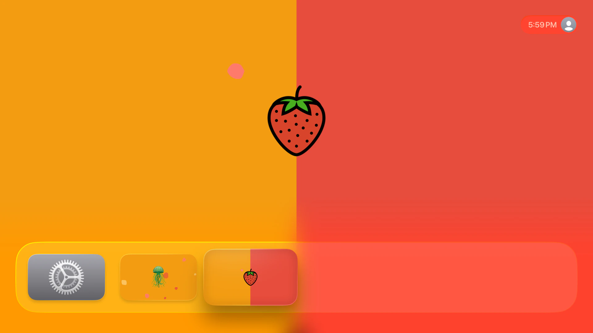
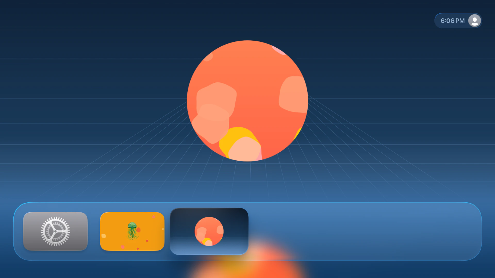
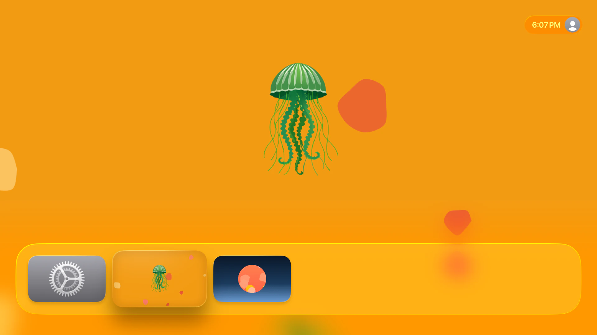
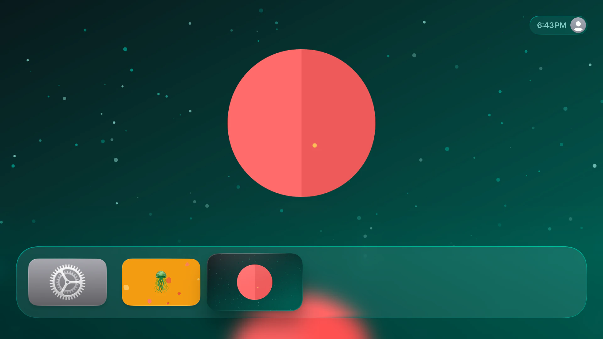

# tvos-assets

Generates a complete tvOS and iOS `Images.xcassets` bundle from an icon and a background image. Produces all required tvOS Brand Assets (app icons with parallax layers, Top Shelf images), an iOS `AppIcon.appiconset` with light/dark/tinted (iOS 18+) variants, splash screen assets, and a standalone `icon.png`, ready to drop into an Xcode or React Native project. Usable as a CLI, a programmatic API, or an Expo config plugin that regenerates everything at prebuild time.

<p align="center">
  
</p>

## Quick Start

```bash
npx tvos-assets --icon ./icon.png --background ./bg.png --color "#F39C12"
```

Generates a timestamped zip on your Desktop containing `Images.xcassets`, `icon.png`, and a `preview.html` contact sheet of every generated image. Each run produces a unique file, so nothing is overwritten.

## Contents

- [Install](#install)
- [Requirements](#requirements)
- [Usage](#usage)
- [CLI options](#cli-options)
- [Overriding any config key with `--set`](#overriding-any-config-key-with---set)
- [Option parity: CLI, config file, plugin](#option-parity-cli-config-file-plugin)
- [preview.html](#previewhtml)
- [Expo config plugin](#expo-config-plugin)
- [iOS app icon variants (iOS 18+)](#ios-app-icon-variants-ios-18)
- [Per-layer parallax art](#per-layer-parallax-art)
- [Programmatic API](#programmatic-api)
- [Examples](#examples)
- [Generated files](#generated-files)
- [Wiring the assets up in Xcode](#wiring-the-assets-up-in-xcode)
- [Input requirements](#input-requirements)
- [Brand asset details](#brand-asset-details)
- [Configuration file](#configuration-file)
- [Using it in CI and build scripts](#using-it-in-ci-and-build-scripts)
- [Troubleshooting](#troubleshooting)
- [Development](#development)
- [License](#license)

## Install

**Global** (adds `tvos-assets` to your PATH):

```bash
npm install -g tvos-assets
```

**Run without installing** (via npx):

```bash
npx tvos-assets --icon ./icon.png --background ./bg.png --color "#F39C12"
```

**Project dependency** (for a build script or the Expo plugin):

```bash
npm install --save-dev tvos-assets
```

## Requirements

- Node.js >= 18. This is a CLI tool, it does not run in the browser.
- [sharp](https://sharp.pixelplumbing.com/install) native dependency, installed automatically. See its platform support page if install fails.

## Usage

```bash
tvos-assets --icon <path> --background <path> --color <hex> [options]
```

The three inputs can come from flags or from a config file. Once a config file supplies them, the whole command is just:

```bash
tvos-assets
```

**Config file discovery.** When `--config` is omitted, the CLI looks for `tvos-assets.config.json` in the current directory and uses it if present. The banner says `(auto-detected)` when that happens. Pass `--config <path>` to point somewhere else. Run `tvos-assets --init` to scaffold a starter file.

**Precedence**, lowest to highest:

```
built-in defaults  ->  config file  ->  --set  ->  named flags  ->  --icon / --background / --color
```

So a config file can set everything, `--set` can override any single key of it, and a named flag beats a `--set` for the same key.

**Output.** By default a uniquely timestamped zip (for example `tvos-assets-20260805-083335.zip`) is written to `~/Desktop`, falling back to `~` if there is no Desktop folder. `--out-dir` writes `Images.xcassets/` and `icon.png` straight into a directory instead: asset folders owned by this tool are cleaned and rewritten, and every other entry in the catalog is left untouched.

SVG inputs are rasterized at whatever density each output size needs, so a small viewBox still produces a crisp 4K Top Shelf image.

## CLI options

### Inputs

| Option | Required | Description |
|---|---|---|
| `--icon <path>` | Yes | Icon PNG or SVG with a transparent background. |
| `--background <path>` | Yes | Background PNG or SVG. |
| `--color <hex>` | Yes | Splash background hex `#RRGGBB` (light mode), for example `"#F39C12"`. |
| `--dark-color <hex>` | No | Dark mode splash background hex. Auto-darkened from `--color` (50% HSL lightness reduction) when omitted. |
| `--icon-dark <path>` | No | iOS dark-appearance icon override. Derived from `--icon` on transparency when omitted. |
| `--icon-tinted <path>` | No | iOS tinted-appearance icon override. A grayscale of `--icon` when omitted. |
| `--icon-border-radius <px>` | No | Corner radius for the icon in pixels. `0` is square (default), a value at or above half the icon width gives a circle. |
| `--layer-front <path>` | No | Custom front parallax layer art, applied to both imagestacks. |
| `--layer-middle <path>` | No | Custom middle parallax layer art. |
| `--layer-back <path>` | No | Custom back parallax layer art. |

### Output

| Option | Description |
|---|---|
| `--config <path>` | Config JSON file. Defaults to `./tvos-assets.config.json` when that file exists. |
| `--output <path>` | Directory to write the zip into. Defaults to `~/Desktop`. |
| `--out-dir <path>` | Write `Images.xcassets/` and `icon.png` directly into this directory instead of a zip. Implies `--mode dir`. |
| `--mode <zip\|dir>` | Output mode. `--out-dir` sets this for you. |
| `--platforms <list>` | Which icon families to generate: `tvos`, `ios`, or both (the default). `tvos` produces the brandassets, `ios` produces the appiconset. Splash assets are generated either way. |
| `--preview` | Write `preview.html`. On by default for zip output, off for `--out-dir`. |
| `--no-preview` | Skip `preview.html`. |

### Asset naming and selection

| Option | Description |
|---|---|
| `--brand-name <name>` | Name of the `.brandassets` bundle. Default `AppIcon`. Must match `ASSETCATALOG_COMPILER_APPICON_NAME`. |
| `--ios-icon-name <name>` | Name of the iOS `.appiconset`. Default `AppIcon`. |
| `--splash-logo-name <name>` | Name of the splash logo imageset. Default `SplashScreenLogo`. |
| `--splash-background-name <name>` | Name of the splash background colorset. Default `SplashScreenBackground`. |
| `--splash-logo-size <px>` | Base splash logo size in pixels, multiplied by each scale. Default `200`. |
| `--no-ios-icon` | Skip the iOS `AppIcon.appiconset`. |
| `--no-top-shelf` | Skip both Top Shelf imagesets. |
| `--no-splash` | Skip the splash logo imageset and the background colorset. |

### Advanced

| Option | Description |
|---|---|
| `--set <path=value>` | Override any config key by dotted path. Repeatable. See below. |
| `--dry-run` | Report the asset directories and file counts that would be written, then exit without touching disk. |
| `--print-config` | Print the fully merged config as JSON and exit. The tool for debugging precedence. |
| `--init [path]` | Write a starter `tvos-assets.config.json` and exit. Refuses to overwrite an existing file. |
| `--quiet` | Print only errors and the final output path. For CI and npm scripts. |
| `--version` | Print the version. |
| `--help` | Show help, including a `--set` cheatsheet and examples. |

## Overriding any config key with `--set`

Every key the config file accepts is reachable from the CLI with `--set key.path=value`, including the ones with no dedicated flag (sizes, scales, file prefixes, per-layer source, Contents.json metadata):

```bash
tvos-assets --icon icon.svg --background bg.png --color "#1C1C1E" \
  --set brandAssets.appIconSmall.size.width=500 \
  --set brandAssets.topShelfImage.scales=1x,2x \
  --set brandAssets.appIconLarge.enabled=false \
  --set splashScreen.background.tv.dark=#000000 \
  --set xcassetsMeta.author=mytool
```

The flag is repeatable, and values are coerced to whatever type that key expects:

| Key type | Accepted value | Example |
|---|---|---|
| string | Used as-is | `--set brandAssets.name=AppIconTV` |
| number | Any finite number | `--set splashScreen.logo.baseSize=300` |
| boolean | `true` or `false` only | `--set iosIcon.enabled=false` |
| array | Comma-separated, whitespace trimmed | `--set brandAssets.topShelfImage.scales=1x,2x` |

Paths are validated against the real config shape, so typos fail loudly instead of being silently ignored:

```
$ tvos-assets ... --set iosIcon.enabledd=false
Error: Unknown --set path "iosIcon.enabledd". "iosIcon" has no key "enabledd". Available: enabled, name.
```

Use `--print-config` to confirm what a combination of config file, `--set`, and flags actually resolved to.

## Option parity: CLI, config file, plugin

Every capability, and how to reach it from each surface. "via `config`" means the plugin takes it through its `config` prop pointing at a JSON file.

| Capability | CLI | Config key | Plugin prop |
|---|---|---|---|
| Icon | `--icon` | `inputs.iconImage` | `icon` |
| Background | `--background` | `inputs.backgroundImage` | `background` |
| Splash color (light) | `--color` | `inputs.backgroundColor` | `color` |
| Splash color (dark) | `--dark-color` | `inputs.darkBackgroundColor` | `darkColor` |
| Icon corner radius | `--icon-border-radius` | `inputs.iconBorderRadius` | `iconBorderRadius` |
| iOS dark icon | `--icon-dark` | `inputs.iconDarkImage` | `iconDark` |
| iOS tinted icon | `--icon-tinted` | `inputs.iconTintedImage` | `iconTinted` |
| Output directory | `--output`, `--out-dir` | `output.directory` | fixed to the app's catalog |
| Output mode | `--mode`, `--out-dir` | `output.mode` | always `dir` |
| Brandassets bundle name | `--brand-name` | `brandAssets.name` | via `config` |
| Home screen icon on/off | `--set brandAssets.appIconSmall.enabled=` | `brandAssets.appIconSmall.enabled` | via `config` |
| Home screen icon name | `--set brandAssets.appIconSmall.name=` | `brandAssets.appIconSmall.name` | via `config` |
| Home screen icon size | `--set brandAssets.appIconSmall.size.width=` | `brandAssets.appIconSmall.size` | via `config` |
| Home screen icon scales | `--set brandAssets.appIconSmall.scales=` | `brandAssets.appIconSmall.scales` | via `config` |
| App Store icon (all of the above) | `--set brandAssets.appIconLarge.*=` | `brandAssets.appIconLarge.*` | via `config` |
| Per-layer parallax art | `--layer-front`, `--layer-middle`, `--layer-back` | `brandAssets.*.layers.*.imagePath` | `layers` |
| Per-layer source | `--set brandAssets.*.layers.*.source=` | `brandAssets.*.layers.*.source` | via `config` |
| Top Shelf on/off | `--no-top-shelf` | `brandAssets.topShelfImage(Wide).enabled` | via `config` |
| Top Shelf name, size, scales, prefix | `--set brandAssets.topShelfImage.*=` | `brandAssets.topShelfImage.*` | via `config` |
| iOS appiconset on/off | `--no-ios-icon` | `iosIcon.enabled` | via `config` |
| iOS appiconset name | `--ios-icon-name` | `iosIcon.name` | via `config` |
| Splash logo on/off | `--no-splash` | `splashScreen.logo.enabled` | via `config` |
| Splash logo name | `--splash-logo-name` | `splashScreen.logo.name` | via `config` |
| Splash logo base size | `--splash-logo-size` | `splashScreen.logo.baseSize` | via `config` |
| Splash logo scales | `--set splashScreen.logo.universal.scales=` | `splashScreen.logo.universal.scales`, `.tv.scales` | via `config` |
| Splash logo file prefix | `--set splashScreen.logo.filePrefix=` | `splashScreen.logo.filePrefix` | via `config` |
| Splash background on/off | `--no-splash` | `splashScreen.background.enabled` | via `config` |
| Splash background name | `--splash-background-name` | `splashScreen.background.name` | via `config` |
| Per-idiom splash colors | `--set splashScreen.background.tv.dark=` | `splashScreen.background.{universal,tv}.{light,dark}` | via `config` |
| Contents.json metadata | `--set xcassetsMeta.author=` | `xcassetsMeta.author`, `.version` | via `config` |
| Platform selection | `--platforms` | not a config key | `EXPO_TV=1` environment variable |
| preview.html | `--preview`, `--no-preview` | not a config key | not written |

## preview.html

Every zip ships with a `preview.html` contact sheet. Open it in any browser to check the output before touching Xcode. It is a single self-contained file with every image embedded, so it works offline and can be shared as-is.

It shows:

- Each generated asset directory as its own section, with the real filename and true pixel dimensions under every image (not the thumbnail size).
- The Front/Middle/Back layers of both imagestacks as an **interactive parallax stack**: point at it and the layers separate the way tvOS moves them on focus. This is the one thing a flat thumbnail cannot show you.
- Transparent assets on a checkerboard, so you can see exactly where the alpha is.
- The splash colorset as light and dark swatches with their hex values.
- A run header with your inputs, colors, radius, platforms, file count, and version.

The page follows your system light/dark setting and has a toggle, and it picks up your `--color` as its accent.

Use `--no-preview` to skip it. With `--out-dir` it is off by default (that directory is your Xcode project); pass `--preview` to write it there anyway.

## Expo config plugin

Regenerate all assets automatically on every `expo prebuild`, for both tvOS (`EXPO_TV=1`) and iOS builds:

```json
"plugins": [
  ["tvos-assets/plugin", {
    "icon": "./assets/brand/icon.svg",
    "background": "./assets/brand/background.png",
    "color": "#1C1C1E",
    "iconBorderRadius": 0,
    "layers": { "front": "./assets/brand/layer-front.svg", "middle": "./assets/brand/layer-middle.svg" }
  }]
]
```

Install as a devDependency (`npm i -D tvos-assets`) and list the plugin **after** `expo-splash-screen` (and any TV config plugin, such as `@react-native-tvos/config-tv`) so the generated splash imagesets overwrite their single-icon output.

### Plugin props

| Prop | Type | Required | Description |
|---|---|---|---|
| `icon` | string | Yes | Icon PNG or SVG, transparent background. Relative to project root. |
| `background` | string | Yes | Background PNG or SVG. |
| `color` | string | Yes | Splash background hex `#RRGGBB` (light mode). |
| `darkColor` | string | No | Splash background hex for dark mode. Auto-darkened from `color` when omitted. |
| `iconBorderRadius` | number | No | Corner radius in px applied to the icon (`0` square, large value circle). |
| `iconDark` | string | No | iOS dark-appearance icon override. Auto-derived from `icon` when omitted. |
| `iconTinted` | string | No | iOS tinted-appearance icon override. Grayscale of `icon` when omitted. |
| `layers` | object | No | `{ "front": path, "middle": path, "back": path }` per-layer parallax art, applied to both imagestacks. Any subset. |
| `config` | string | No | Path to a full JSON config file (same schema as `--config`), deep-merged under the props above. Use this to reach any key that has no dedicated prop. |

All paths resolve relative to the project root.

### What runs when

The plugin registers an iOS dangerous mod, so it executes inside every `expo prebuild`. There is no separate command to run, and nothing needs to be committed under `ios/`:

- **`EXPO_TV=1 expo prebuild`** writes the parallax `AppIcon.brandassets` (home and App Store imagestacks, Top Shelf standard and wide) into `ios/<project>/Images.xcassets/`, and sets the tvOS `Info.plist` keys `CFBundleIcons.CFBundlePrimaryIcon` and `TVTopShelfImage.TVTopShelfPrimaryImage(-Wide)`.
- **`expo prebuild`** (no `EXPO_TV`) writes `AppIcon.appiconset` with light, dark, and tinted 1024x1024 variants, replacing the Expo-generated single-size icon.
- **Both** write the splash screen logo imageset and background colorset.

Asset directories owned by the plugin (`AppIcon.brandassets`, `AppIcon.appiconset`, `SplashScreenLogo.imageset`, `SplashScreenBackground.colorset`) are cleaned and rewritten on each run. Everything else in the catalog is left untouched. Changing your app icon becomes: replace the input files, run prebuild.

`@expo/config-plugins` is an optional peer dependency. The plugin uses the copy already present in your app, so no extra install is needed. This also works when `tvos-assets` is linked locally via `file:` or `link:`.

## iOS app icon variants (iOS 18+)

The generated `AppIcon.appiconset` contains three 1024x1024 entries, matching how iOS 18 renders home screen appearances:

| Variant | Composition | Source |
|---|---|---|
| Light | Icon composited on the background image, opaque | `icon` + `background` |
| Dark | Icon on a transparent canvas, Apple supplies the dark gradient behind it | `iconDark`, or auto-derived from `icon` |
| Tinted | Grayscale icon on a transparent canvas, Apple applies the user's tint color | `iconTinted`, or auto-derived (grayscale of `icon`) |

The auto-derived variants are good defaults for most marks. Provide overrides when the main icon loses contrast in grayscale, or when you want a brighter rework for dark mode.

## Per-layer parallax art

By default the Front and Middle imagestack layers both render the whole icon, and Back renders the background. For true parallax depth, supply separate art per layer:

```bash
tvos-assets --icon icon.svg --background bg.png --color "#1C1C1E" \
  --layer-front ./layer-front.svg --layer-middle ./layer-middle.svg
```

Or per stack in a config file (`brandAssets.<stack>.layers.<layer>.imagePath`), or with the plugin's `layers` prop:

```json
"layers": {
  "front": "./assets/brand/layer-front.svg",
  "middle": "./assets/brand/layer-middle.svg"
}
```

Registration matters. Icon-sourced layers are all placed identically (centered, scaled to 60% of the shorter output side), so export every layer from the **same square artboard** as the full icon and they stay perfectly aligned in the stack. A typical split puts highlights and foreground detail on Front, the main shape on Middle, and the background image on Back. `iconBorderRadius` is not applied to custom layer art.

Open the generated `preview.html` and point at the imagestack to check your layer separation before building.

## Programmatic API

```js
import { resolveConfig, generateAssets, planAssets } from "tvos-assets";

const config = resolveConfig({
  icon: "./icon.svg",             // same inputs as the CLI flags
  background: "./bg.png",
  color: "#1C1C1E",
  darkColor: "#0E0E10",           // optional, like --dark-color
  config: "./assets.config.json", // optional config file, like --config
  overrides: {                    // optional deep-merged config overrides, like --set
    iosIcon: { enabled: true, name: "AppIcon" },
  },
});

// Count what a run would write, without writing it.
const plan = planAssets(config, { platforms: ["ios"], standaloneIcon: true });
console.log(plan.total, plan.directories);

const { warnings } = await generateAssets(config, "./out/Images.xcassets", {
  platforms: ["tvos", "ios"],                // which icon families; default both
  standaloneIconPath: "./out/icon.png",      // optional flattened 1024x1024 icon
  previewPath: "./out/preview.html",         // optional self-contained contact sheet
  toolVersion: "1.4.0",                      // stamped into the preview header
  onStep: (message) => console.log(message), // progress callback per phase
});
```

`generateAssets(config, xcassetsDir, options)` writes the catalog directly into `xcassetsDir` (created if missing, existing owned asset dirs cleaned first) and resolves to `{ warnings, xcassetsDir }`. `resolveConfig` throws on invalid inputs (missing files, bad hex colors, wrong image formats), so wrap it in try/catch for user-facing tooling.

Also exported: `discoverConfigPath(cwd)`, `configShapeTemplate()`, `CONFIG_FILENAME`, and `validateInputImages(config)`.

## Examples

<p align="center">
  
</p>

Generate to Desktop (default):

```bash
tvos-assets --icon ./icon.png --background ./bg.png --color "#F39C12"
```

Explicit dark mode color and a circular icon:

```bash
tvos-assets --icon ./icon.png --background ./bg.png --color "#F39C12" \
  --dark-color "#7A4E09" --icon-border-radius 512
```

Write straight into an Xcode project, tvOS assets only:

```bash
tvos-assets --icon ./icon.svg --background ./bg.png --color "#1C1C1E" \
  --out-dir ios/MyApp --platforms tvos --brand-name AppIconTV
```

Scaffold a config, then run with no flags at all:

```bash
tvos-assets --init
tvos-assets
```

Check what a run would produce before committing to it:

```bash
tvos-assets --config ./brand.json --dry-run
tvos-assets --config ./brand.json --print-config
```

Config file with CLI overrides (flags take precedence):

```bash
tvos-assets --config ./tvos-assets.config.json --color "#00FF00" --output ./output
```

## Generated files

A default run produces **44 files**: 21 `Contents.json` + 21 PNGs + `icon.png` + `preview.html`.

```
tvos-assets-YYYYMMDD-HHmmss.zip
├── icon.png                                     (1024x1024, icon on background)
├── preview.html                                 (self-contained contact sheet)
└── Images.xcassets/
    ├── Contents.json
    ├── AppIcon.brandassets/
    │   ├── Contents.json
    │   ├── App Icon.imagestack/
    │   │   ├── Contents.json
    │   │   ├── Front.imagestacklayer/
    │   │   │   ├── Contents.json
    │   │   │   └── Content.imageset/
    │   │   │       ├── Contents.json
    │   │   │       ├── front@1x.png             (400x240)
    │   │   │       └── front@2x.png             (800x480)
    │   │   ├── Middle.imagestacklayer/
    │   │   │   ├── Contents.json
    │   │   │   └── Content.imageset/
    │   │   │       ├── Contents.json
    │   │   │       ├── middle@1x.png            (400x240)
    │   │   │       └── middle@2x.png            (800x480)
    │   │   └── Back.imagestacklayer/
    │   │       ├── Contents.json
    │   │       └── Content.imageset/
    │   │           ├── Contents.json
    │   │           ├── back@1x.png              (400x240, opaque)
    │   │           └── back@2x.png              (800x480, opaque)
    │   ├── App Icon - App Store.imagestack/
    │   │   ├── Contents.json
    │   │   ├── Front.imagestacklayer/…/front@1x.png    (1280x768)
    │   │   ├── Middle.imagestacklayer/…/middle@1x.png  (1280x768)
    │   │   └── Back.imagestacklayer/…/back.png         (1280x768, opaque)
    │   ├── Top Shelf Image.imageset/
    │   │   ├── Contents.json
    │   │   ├── top@1x.png                       (1920x720, opaque)
    │   │   └── top@2x.png                       (3840x1440, opaque)
    │   └── Top Shelf Image Wide.imageset/
    │       ├── Contents.json
    │       ├── wide@1x.png                      (2320x720, opaque)
    │       └── wide@2x.png                      (4640x1440, opaque)
    ├── AppIcon.appiconset/
    │   ├── Contents.json
    │   ├── icon-1024.png                        (1024x1024, opaque, light)
    │   ├── icon-1024-dark.png                   (1024x1024, transparent, dark)
    │   └── icon-1024-tinted.png                 (1024x1024, grayscale, tinted)
    ├── SplashScreenLogo.imageset/
    │   ├── Contents.json
    │   ├── 200-icon@1x.png                      (200px)
    │   ├── 200-icon@2x.png                      (400px)
    │   ├── 200-icon@3x.png                      (600px)
    │   ├── 200-icon-tv@1x.png                   (200px, tv)
    │   └── 200-icon-tv@2x.png                   (400px, tv)
    └── SplashScreenBackground.colorset/
        └── Contents.json                        (light/dark color definitions)
```

`--platforms ios` drops the `AppIcon.brandassets` tree, `--platforms tvos` drops `AppIcon.appiconset`, and `--no-splash` drops the last two directories. `--dry-run` prints the exact set for your options.

## Wiring the assets up in Xcode

The generated names have to match what your project references. Defaults are chosen so that a stock Expo or React Native tvOS project works untouched, but if you rename anything, update it in both places.

| Generated asset | Where the name is referenced | Default |
|---|---|---|
| `<name>.brandassets` | `ASSETCATALOG_COMPILER_APPICON_NAME` build setting on the **tvOS** target | `AppIcon` |
| `<name>.appiconset` | `ASSETCATALOG_COMPILER_APPICON_NAME` build setting on the **iOS** target | `AppIcon` |
| App Icon imagestack | `CFBundleIcons` > `CFBundlePrimaryIcon` in the tvOS `Info.plist` | `App Icon` |
| Top Shelf Image | `TVTopShelfImage` > `TVTopShelfPrimaryImage` in `Info.plist` | `Top Shelf Image` |
| Top Shelf Image Wide | `TVTopShelfImage` > `TVTopShelfPrimaryImageWide` in `Info.plist` | `Top Shelf Image Wide` |
| `<name>.imageset` (splash logo) | Image view in your LaunchScreen storyboard | `SplashScreenLogo` |
| `<name>.colorset` (splash background) | Background color in your LaunchScreen storyboard | `SplashScreenBackground` |

The Expo config plugin sets the four `Info.plist` keys for you from whatever names the resolved config carries. For a plain Xcode project, set them yourself.

Drop the generated `Images.xcassets` into your target (or use `--out-dir` to write into the existing one), and make sure it is a member of the right target in the File Inspector.

## Input requirements

- **Icon**: PNG or SVG with a transparent background. Centered and scaled to 60% of the shorter output dimension.
- **Background**: any PNG or SVG. Resized with cover-fit and center-cropped to each required dimension.
- **Color**: hex `#RRGGBB` (for example `#F39C12`). Used for the splash screen background colorset. When `--dark-color` is omitted, a darkened variant is generated automatically (50% HSL lightness reduction) for dark appearances.

### Image size requirements

| Input | Minimum | Recommended | Notes |
|---|---|---|---|
| **Icon** | 1024x1024 | 1024x1024 | Below minimum is an error. 1024x1024 is enough for every output. |
| **Background** | 2320x720 | 4640x1440+ | Below minimum is an error. Below recommended is a warning (Top Shelf @2x may look upscaled). |

Minimums apply to raster (PNG) inputs only. SVGs are vector and exempt.

The tool also warns when an input exceeds 50MB (memory pressure), exceeds 8192px in any dimension, or is not square (the icon will be letterboxed onto a square canvas).

## Brand asset details

### App icon layers (parallax)

tvOS app icons use a 3-layer imagestack for the depth effect when the user moves the Siri Remote:

| Layer | Content | Format |
|---|---|---|
| **Front** | Icon on transparent canvas | PNG with alpha |
| **Middle** | Icon on transparent canvas | PNG with alpha |
| **Back** | Background image only | Opaque PNG (no alpha) |

### Top Shelf images

Composited images (icon centered on background), written as opaque RGB PNGs as tvOS requires.

| Asset | Size (points) | Scales |
|---|---|---|
| Top Shelf Image | 1920x720 | 1x, 2x |
| Top Shelf Image Wide | 2320x720 | 1x, 2x |

### Splash screen

| Asset | Type | Description |
|---|---|---|
| SplashScreenLogo | Imageset | Icon on transparent background at 1x/2x/3x (universal) plus 1x/2x (tv) |
| SplashScreenBackground | Colorset | Light and dark color definitions for universal and tv idioms |

## Configuration file

For full control, create a JSON config file. Every section is optional, omitted values use built-in defaults. Add `$schema` for editor autocompletion and inline validation:

```json
{ "$schema": "./node_modules/tvos-assets/schema.json" }
```

Name it `tvos-assets.config.json` in your project root and the CLI finds it with no flags. `tvos-assets --init` writes a starter file for you. A complete annotated example lives in [`examples/tvos-assets.config.json`](examples/tvos-assets.config.json).

### Minimal config

```json
{
  "$schema": "./node_modules/tvos-assets/schema.json",
  "inputs": {
    "iconImage": "./icon.png",
    "backgroundImage": "./background.png",
    "backgroundColor": "#B43939"
  }
}
```

### Full config

```json
{
  "$schema": "./node_modules/tvos-assets/schema.json",
  "inputs": {
    "iconImage": "./icon.png",
    "backgroundImage": "./background.png",
    "backgroundColor": "#B43939",
    "darkBackgroundColor": "#5A1C1C",
    "iconBorderRadius": 80,
    "iconDarkImage": "./icon-dark.svg",
    "iconTintedImage": "./icon-tinted.svg"
  },
  "output": {
    "directory": "./output",
    "mode": "zip"
  },
  "brandAssets": {
    "name": "AppIcon",
    "appIconSmall": {
      "enabled": true,
      "name": "App Icon",
      "size": { "width": 400, "height": 240 },
      "scales": ["1x", "2x"],
      "layers": {
        "front": { "source": "icon", "imagePath": "./layer-front.svg" },
        "middle": { "source": "icon", "imagePath": "./layer-middle.svg" },
        "back": { "source": "background" }
      }
    },
    "appIconLarge": {
      "enabled": true,
      "name": "App Icon - App Store",
      "size": { "width": 1280, "height": 768 },
      "scales": ["1x"],
      "layers": {
        "front": { "source": "icon" },
        "middle": { "source": "icon" },
        "back": { "source": "background" }
      }
    },
    "topShelfImage": {
      "enabled": true,
      "name": "Top Shelf Image",
      "size": { "width": 1920, "height": 720 },
      "scales": ["1x", "2x"],
      "filePrefix": "top"
    },
    "topShelfImageWide": {
      "enabled": true,
      "name": "Top Shelf Image Wide",
      "size": { "width": 2320, "height": 720 },
      "scales": ["1x", "2x"],
      "filePrefix": "wide"
    }
  },
  "iosIcon": {
    "enabled": true,
    "name": "AppIcon"
  },
  "splashScreen": {
    "logo": {
      "enabled": true,
      "name": "SplashScreenLogo",
      "baseSize": 200,
      "filePrefix": "200-icon",
      "universal": { "scales": ["1x", "2x", "3x"] },
      "tv": { "scales": ["1x", "2x"] }
    },
    "background": {
      "enabled": true,
      "name": "SplashScreenBackground",
      "universal": { "light": "#B43939", "dark": "#5A1C1C" },
      "tv": { "light": "#B43939", "dark": "#5A1C1C" }
    }
  },
  "xcassetsMeta": {
    "author": "xcode",
    "version": 1
  }
}
```

### Config reference

<p align="center">
  
</p>

#### `inputs`

| Key | Type | Required | Description |
|---|---|---|---|
| `iconImage` | string | Yes | Path to the app icon PNG or SVG (transparent background). |
| `backgroundImage` | string | Yes | Path to the background PNG or SVG. |
| `backgroundColor` | string | Yes | Hex `#RRGGBB` for the splash screen background. Also the basis for the dark variant when `darkBackgroundColor` is omitted. |
| `darkBackgroundColor` | string | No | Hex `#RRGGBB` for the dark mode splash background. Auto-darkened from `backgroundColor` (50% lightness reduction) when omitted. |
| `iconBorderRadius` | number | No | Corner radius in pixels. `0` is square (default), a large value gives a circle. |
| `iconDarkImage` | string | No | iOS dark-appearance icon override (PNG or SVG). Auto-derived from `iconImage` when omitted. |
| `iconTintedImage` | string | No | iOS tinted-appearance icon override (PNG or SVG). Grayscale of `iconImage` when omitted. |

#### `output`

| Key | Type | Default | Description |
|---|---|---|---|
| `directory` | string | `~/Desktop` | Output directory. Zip location in `"zip"` mode, catalog destination in `"dir"` mode. |
| `mode` | string | `"zip"` | `"zip"` writes a timestamped archive. `"dir"` writes `Images.xcassets/` and `icon.png` directly into `directory` (what the Expo plugin uses). |

#### `brandAssets`

| Key | Type | Default | Description |
|---|---|---|---|
| `name` | string | `"AppIcon"` | Folder name for the `.brandassets` bundle. Must match `ASSETCATALOG_COMPILER_APPICON_NAME` in Xcode. |

All four assets are required by tvOS but can be individually disabled with `"enabled": false`.

**`appIconSmall`**, the home screen app icon (3-layer parallax imagestack):

| Key | Type | Default | Description |
|---|---|---|---|
| `enabled` | boolean | `true` | Set to `false` to skip. |
| `name` | string | `"App Icon"` | Folder name in the Brand Assets catalog. |
| `size` | `{width, height}` | `{400, 240}` | Base size in points, multiplied by each scale. |
| `scales` | string[] | `["1x", "2x"]` | Scale factors to generate. |
| `layers` | object | see below | Layer configuration. |

**`appIconLarge`**, the App Store icon (same structure, 1x only):

| Key | Type | Default | Description |
|---|---|---|---|
| `enabled` | boolean | `true` | Set to `false` to skip. |
| `name` | string | `"App Icon - App Store"` | Folder name in the Brand Assets catalog. |
| `size` | `{width, height}` | `{1280, 768}` | Base size in points. |
| `scales` | string[] | `["1x"]` | The App Store only needs 1x. |
| `layers` | object | see below | Layer configuration. |

**Layer configuration:**

```json
"layers": {
  "front":  { "source": "icon", "imagePath": "./layer-front.svg" },
  "middle": { "source": "icon" },
  "back":   { "source": "background" }
}
```

- `"icon"` renders the icon centered on a transparent canvas (PNG with alpha).
- `"background"` uses the background image only (opaque, no alpha channel).
- `imagePath` (optional) replaces the default source file for that layer with custom parallax art. `source` still controls rendering: icon layers sit centered on transparency, background layers cover-fill opaque. Border radius is not applied to custom layer art. See [Per-layer parallax art](#per-layer-parallax-art).

**`topShelfImage`** and **`topShelfImageWide`**:

| Key | Type | Default (standard / wide) | Description |
|---|---|---|---|
| `enabled` | boolean | `true` | Set to `false` to skip. |
| `name` | string | `"Top Shelf Image"` / `"Top Shelf Image Wide"` | Folder name. |
| `size` | `{width, height}` | `{1920, 720}` / `{2320, 720}` | Base size in points. |
| `scales` | string[] | `["1x", "2x"]` | Scale factors. |
| `filePrefix` | string | `"top"` / `"wide"` | Filename prefix. |

#### `iosIcon`

| Key | Type | Default | Description |
|---|---|---|---|
| `enabled` | boolean | `true` | Set to `false` to skip generating the iOS `AppIcon.appiconset`. |
| `name` | string | `"AppIcon"` | Folder name for the `.appiconset`. Must match `ASSETCATALOG_COMPILER_APPICON_NAME` for the iOS target. |

Produces `icon-1024.png` (light, opaque), `icon-1024-dark.png` (transparent), and `icon-1024-tinted.png` (grayscale, transparent) with the appearance entries iOS 18 expects. See [iOS app icon variants](#ios-app-icon-variants-ios-18).

#### `splashScreen`

**`splashScreen.logo`**

| Key | Type | Default | Description |
|---|---|---|---|
| `enabled` | boolean | `true` | Set to `false` to skip. |
| `name` | string | `"SplashScreenLogo"` | Imageset folder name. Must match your LaunchScreen storyboard. |
| `baseSize` | number | `200` | Base icon size in px, multiplied by each scale. |
| `filePrefix` | string | `"200-icon"` | Filename prefix. |
| `universal.scales` | string[] | `["1x", "2x", "3x"]` | Scales for non-TV devices. |
| `tv.scales` | string[] | `["1x", "2x"]` | Scales for Apple TV. |

**`splashScreen.background`**

| Key | Type | Default | Description |
|---|---|---|---|
| `enabled` | boolean | `true` | Set to `false` to skip. |
| `name` | string | `"SplashScreenBackground"` | Colorset folder name. Must match your LaunchScreen storyboard. |
| `universal.light` | string | same as `--color` | Light mode color for non-TV. |
| `universal.dark` | string | auto-darkened from `--color` | Dark mode color for non-TV. Falls back to `--dark-color` or the auto-darkened value. |
| `tv.light` | string | same as `--color` | Light mode color for Apple TV. |
| `tv.dark` | string | auto-darkened from `--color` | Dark mode color for Apple TV. |

#### `xcassetsMeta`

| Key | Type | Default | Description |
|---|---|---|---|
| `author` | string | `"xcode"` | Author field in every Contents.json. |
| `version` | integer | `1` | Version field in every Contents.json. |

## Using it in CI and build scripts

`--quiet` prints only errors and the final output path, so it composes cleanly:

```json
"scripts": {
  "icons": "tvos-assets --out-dir ios/MyApp --quiet --no-preview"
}
```

With a `tvos-assets.config.json` in the repo root, that script needs no flags for the inputs. Commit the config and the source art, not the generated catalog.

To fail a build when the config drifts from what you expect, resolve it without writing anything:

```bash
tvos-assets --print-config > /dev/null   # non-zero exit on any invalid config
tvos-assets --dry-run                    # human-readable manifest, writes nothing
```

For Expo projects, prefer the [config plugin](#expo-config-plugin) over a script: it runs inside `expo prebuild` automatically and handles the `Info.plist` keys.

## Troubleshooting

**"Icon image is too small (…)."** Raster icons must be at least 1024x1024. Either export a larger PNG or switch to SVG, which is exempt because it rasterizes at whatever density each output needs.

**Top Shelf images look soft or upscaled.** The @2x Top Shelf Wide output is 4640x1440. A background smaller than that gets upscaled. The tool warns below the recommended 4640x1440. Use a larger background or an SVG.

**A config file value seems to be ignored.** Run `tvos-assets --print-config` to see the fully merged result. Remember the order: config file loses to `--set`, which loses to named flags, which lose to `--icon`/`--background`/`--color`.

**A `--set` path is rejected.** The error names the valid keys at that level. Paths are checked against the real config shape, so a rejection means the key does not exist, not that the value is wrong.

**Xcode does not show the icon.** The bundle name has to match `ASSETCATALOG_COMPILER_APPICON_NAME` on that target, and the catalog has to be a member of the target. See [Wiring the assets up in Xcode](#wiring-the-assets-up-in-xcode).

**Expo prebuild overwrites the splash assets.** List `tvos-assets/plugin` **after** `expo-splash-screen` and after any TV config plugin in your `plugins` array. Plugins run in order and the last one wins.

**The plugin generated iOS icons when you wanted tvOS ones.** The plugin branches on `EXPO_TV`. Run `EXPO_TV=1 expo prebuild` for the tvOS brandassets.

**sharp fails to install.** See the [sharp installation guide](https://sharp.pixelplumbing.com/install) for your platform and architecture. It is a native dependency and needs a prebuilt binary or a working build toolchain.

**The output directory is not writable.** The path is validated before any work starts, walking up to the nearest existing ancestor. Check permissions on that ancestor.

## Development

```bash
git clone https://github.com/keiver/tvos-assets.git
cd tvos-assets
npm install
```

| Script | Description |
|---|---|
| `npm run dev` | Run directly from TypeScript source (`tsx src/index.ts`) |
| `npm run build` | Compile to JavaScript in `dist/` |
| `npm start` | Run the compiled build |
| `npm test` | Run tests |
| `npm run test:coverage` | Run tests with a coverage report |

`dist/` is generated, not committed. A `prepare` script builds it automatically on `npm install`, before publishing, and when the package is installed as a git dependency (`npm i github:keiver/tvos-assets`).

To verify a change the way a consumer would see it, install the packed tarball into a scratch project:

```bash
npm pack --pack-destination /tmp/consumer
cd /tmp/consumer && npm init -y && npm i ./tvos-assets-*.tgz

npx tvos-assets --version                                            # bin entry
node -e 'import("tvos-assets").then(m => console.log(Object.keys(m)))' # ESM library
node -e 'console.log(typeof require("tvos-assets/plugin"))'           # CJS plugin entry
```

This exercises `files`, `exports`, and `bin`, which running from source does not. Note that `file:` and `link:` installs do not run `prepare`, so build first when testing the Expo plugin against a linked checkout.

Run with arguments during development:

```bash
npx tsx src/index.ts --icon ./input/icon.png --background ./input/bg.png --color "#F39C12"
npx tsx src/index.ts --config ./examples/tvos-assets.config.json
```

## Demo assets

The icons and backgrounds in the preview screenshots were generated with this [tool](https://keiver.dev/lab/poster-generator).

<p align="center">
  
</p>

## License

MIT
