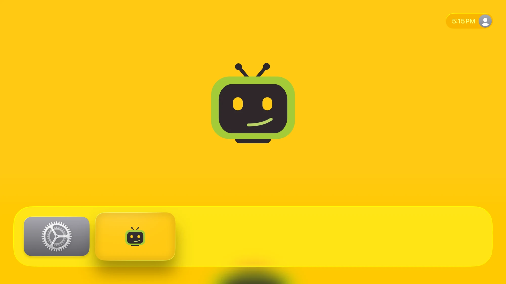
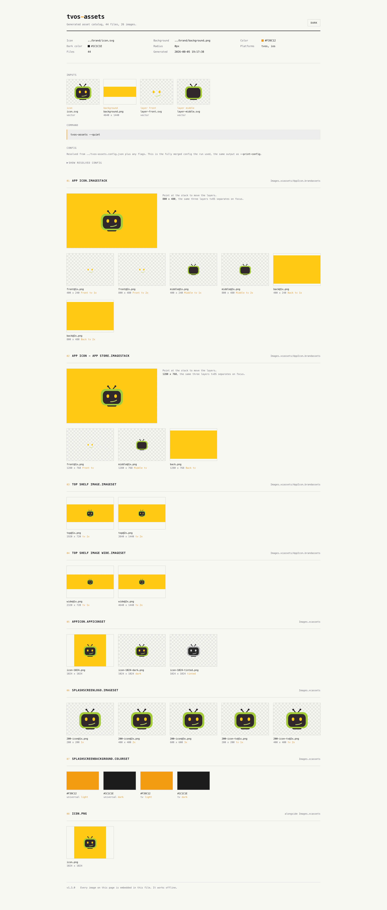

# tvos-assets

**Apple TV asset generation, from three inputs.** Give it an icon, a background, and a hex color, and it builds the whole `Images.xcassets` catalog tvOS expects: layered parallax app icons for the home screen and the App Store, both Top Shelf banners, and the splash screen assets. Everything is named and nested exactly the way Xcode wants it.

The same artwork almost always ships an iOS companion app, so it **also** generates a matching `AppIcon.appiconset` with light, dark, and tinted (iOS 18+) variants, keeping both platforms in sync from one source of truth. Use `--platforms` to limit a run to either family.

Use it as a CLI, a programmatic API, or an Expo config plugin that regenerates everything on `expo prebuild`.

<p align="center">
  
</p>

## Quick start

```bash
npx tvos-assets --icon ./icon.png --background ./bg.png --color "#F39C12"
```

That writes a timestamped zip to your Desktop with three things in it:

| Artifact | Description |
|---|---|
| `Images.xcassets/` | 42 files: tvOS brand assets, the iOS appiconset, splash logo and colorset |
| `icon.png` | flattened 1024x1024 |
| **`preview.html`** | **a contact sheet of everything generated, written on every run.** Open it first, see [preview.html](#previewhtml) |

Each run produces a uniquely named zip, so nothing is ever overwritten.

## Install

```bash
npm install -g tvos-assets     # global, adds tvos-assets to PATH
npm install --save-dev tvos-assets   # project dependency, for build scripts or the Expo plugin
npx tvos-assets --help         # no install
```

Requires Node.js >= 18 and the [sharp](https://sharp.pixelplumbing.com/install) native dependency (installed automatically). This is a command line tool; it does not run in the browser.

## Usage

```bash
tvos-assets --icon <path> --background <path> --color <hex> [options]
```

The three inputs can come from flags or from a config file. Once a config file supplies them, the whole command is just `tvos-assets`.

**Config file discovery.** When `--config` is omitted, the CLI looks for `tvos-assets.config.json` in the current directory and uses it if present. The banner says `(auto-detected)` when that happens. Run `tvos-assets --init` to scaffold a starter file.

**Precedence**, lowest to highest:

```
built-in defaults  ->  config file  ->  --set  ->  named flags  ->  --icon / --background / --color
```

**Output.** By default a uniquely timestamped zip (for example `tvos-assets-20260805-083335.zip`) is written to `~/Desktop`, falling back to `~` if there is no Desktop folder. `--out-dir` writes `Images.xcassets/` and `icon.png` straight into a directory instead: asset folders owned by this tool are cleaned and rewritten, and every other entry in the catalog is left untouched.

SVG inputs are rasterized at whatever density each output size needs, so a small viewBox still produces a crisp 4K Top Shelf image.

## Options

Every option, on every surface. **Config key** is the dotted path in `tvos-assets.config.json`, which is also the path `--set` takes. **Plugin** is the [Expo config plugin](#expo-config-plugin) prop; `via config` means the plugin reaches it through its `config` prop pointing at a JSON file.

| Option | Config key | Plugin | Type | Default | Description |
|---|---|---|---|---|---|
| `--icon <path>` | `inputs.iconImage` | `icon` | path | **required** | Icon PNG or SVG with a transparent background. |
| `--background <path>` | `inputs.backgroundImage` | `background` | path | **required** | Background PNG or SVG. |
| `--color <hex>` | `inputs.backgroundColor` | `color` | `#RRGGBB` | **required** | Splash background color, light mode. |
| `--dark-color <hex>` | `inputs.darkBackgroundColor` | `darkColor` | `#RRGGBB` | auto | Dark mode splash background. Auto-darkened from `--color` (50% HSL lightness reduction). |
| `--icon-dark <path>` | `inputs.iconDarkImage` | `iconDark` | path | auto | iOS dark-appearance icon override. Derived from the icon on transparency. |
| `--icon-tinted <path>` | `inputs.iconTintedImage` | `iconTinted` | path | auto | iOS tinted-appearance icon override. Grayscale of the icon. |
| `--icon-border-radius <px>` | `inputs.iconBorderRadius` | `iconBorderRadius` | number | `0` | Icon corner radius. `0` is square, a value at or above half the icon width gives a circle. Not applied to custom layer art. |
| `--output <path>` | `output.directory` | fixed | path | `~/Desktop` | Where the zip is written. In `dir` mode, where the catalog is written. |
| `--out-dir <path>` | `output.directory` | fixed | path | none | Write `Images.xcassets/` and `icon.png` into this directory instead of a zip. Implies `--mode dir`. |
| `--mode <zip\|dir>` | `output.mode` | always `dir` | `zip` \| `dir` | `zip` | Output mode. `--out-dir` sets this for you. |
| `--platforms <list>` | not a config key | `EXPO_TV=1` | `tvos`, `ios` | both | Icon families to generate. `tvos` produces the brandassets, `ios` the appiconset. Splash assets are generated either way. |
| `--preview` / `--no-preview` | not a config key | not written | boolean | on | Write `preview.html` alongside the output. |
| `--brand-name <name>` | `brandAssets.name` | via `config` | string | `AppIcon` | Name of the `.brandassets` bundle. Must match `ASSETCATALOG_COMPILER_APPICON_NAME` on the tvOS target. |
| `--set brandAssets.appIconSmall.enabled=` | `brandAssets.appIconSmall.enabled` | via `config` | boolean | `true` | Home screen parallax imagestack on/off. |
| `--set brandAssets.appIconSmall.name=` | `brandAssets.appIconSmall.name` | via `config` | string | `App Icon` | Folder name. Must match `CFBundleIcons` > `CFBundlePrimaryIcon`. |
| `--set brandAssets.appIconSmall.size.width=` | `brandAssets.appIconSmall.size` | via `config` | `{width,height}` | `400x240` | Base size in points, multiplied by each scale. |
| `--set brandAssets.appIconSmall.scales=` | `brandAssets.appIconSmall.scales` | via `config` | string[] | `1x,2x` | Scale factors to generate. |
| `--set brandAssets.appIconLarge.*=` | `brandAssets.appIconLarge.*` | via `config` | same four keys | `App Icon - App Store`, `1280x768`, `1x` | App Store imagestack. Same structure as `appIconSmall`. |
| `--layer-front`, `--layer-middle`, `--layer-back` | `brandAssets.<stack>.layers.<layer>.imagePath` | `layers` | path | icon, icon, background | Custom parallax art per layer. The CLI flags apply to both imagestacks. See [Per-layer parallax art](#per-layer-parallax-art). |
| `--set brandAssets.<stack>.layers.<layer>.source=` | `brandAssets.<stack>.layers.<layer>.source` | via `config` | `icon` \| `background` | front/middle `icon`, back `background` | How the layer renders: `icon` is centered on transparency, `background` is an opaque cover fill. |
| `--no-top-shelf` | `brandAssets.topShelfImage(Wide).enabled` | via `config` | boolean | `true` | Both Top Shelf imagesets on/off. |
| `--set brandAssets.topShelfImage.name=` | `brandAssets.topShelfImage(Wide).name` | via `config` | string | `Top Shelf Image` / `… Wide` | Folder name. Must match the `TVTopShelfImage` `Info.plist` keys. |
| `--set brandAssets.topShelfImage.size.width=` | `brandAssets.topShelfImage(Wide).size` | via `config` | `{width,height}` | `1920x720` / `2320x720` | Base size in points. |
| `--set brandAssets.topShelfImage.scales=` | `brandAssets.topShelfImage(Wide).scales` | via `config` | string[] | `1x,2x` | Scale factors. |
| `--set brandAssets.topShelfImage.filePrefix=` | `brandAssets.topShelfImage(Wide).filePrefix` | via `config` | string | `top` / `wide` | Output filename prefix. |
| `--no-ios-icon` | `iosIcon.enabled` | via `config` | boolean | `true` | iOS `AppIcon.appiconset` on/off. |
| `--ios-icon-name <name>` | `iosIcon.name` | via `config` | string | `AppIcon` | Name of the `.appiconset`. Must match `ASSETCATALOG_COMPILER_APPICON_NAME` on the iOS target. |
| `--no-splash` | `splashScreen.logo.enabled`, `splashScreen.background.enabled` | via `config` | boolean | `true` | Splash logo imageset and background colorset on/off. |
| `--splash-logo-name <name>` | `splashScreen.logo.name` | via `config` | string | `SplashScreenLogo` | Imageset folder name. Must match your LaunchScreen storyboard. |
| `--splash-logo-size <px>` | `splashScreen.logo.baseSize` | via `config` | number | `200` | Base logo size in px, multiplied by each scale. |
| `--set splashScreen.logo.filePrefix=` | `splashScreen.logo.filePrefix` | via `config` | string | `200-icon` | Output filename prefix. |
| `--set splashScreen.logo.universal.scales=` | `splashScreen.logo.universal.scales` | via `config` | string[] | `1x,2x,3x` | Splash logo scales for non-TV devices. |
| `--set splashScreen.logo.tv.scales=` | `splashScreen.logo.tv.scales` | via `config` | string[] | `1x,2x` | Splash logo scales for Apple TV. |
| `--splash-background-name <name>` | `splashScreen.background.name` | via `config` | string | `SplashScreenBackground` | Colorset folder name. Must match your LaunchScreen storyboard. |
| `--set splashScreen.background.tv.dark=` | `splashScreen.background.{universal,tv}.{light,dark}` | via `config` | `#RRGGBB` | from `--color` / `--dark-color` | Per-idiom, per-appearance splash background colors. |
| `--set xcassetsMeta.author=` | `xcassetsMeta.author` | via `config` | string | `xcode` | `author` field written into every Contents.json. |
| `--set xcassetsMeta.version=` | `xcassetsMeta.version` | via `config` | integer | `1` | `version` field written into every Contents.json. |
| `--config <path>` | n/a | `config` | path | `./tvos-assets.config.json` if present | Config JSON file. |
| `--set <path=value>` | n/a | n/a | repeatable | none | Override any config key by dotted path. See below. |
| `--dry-run` | n/a | n/a | flag | off | Report the asset directories and file counts that would be written, then exit without touching disk. |
| `--print-config` | n/a | n/a | flag | off | Print the fully merged config as JSON and exit. The tool for debugging precedence. |
| `--init [path]` | n/a | n/a | flag | off | Write a starter config with `$schema` wired up, and exit. Refuses to overwrite. See [About `$schema`](#about-schema). |
| `--quiet` | n/a | n/a | flag | off | Print only errors and the final output path. For CI and npm scripts. |
| `--version`, `--help` | n/a | n/a | flag | off | Version, and help with a `--set` cheatsheet and examples. |

### Overriding any config key with `--set`

Every key above is reachable from the CLI with `--set key.path=value`, repeatable, with values coerced to whatever type that key expects (`true`/`false` for booleans, comma-separated for arrays):

```bash
tvos-assets --icon icon.svg --background bg.png --color "#1C1C1E" \
  --set brandAssets.appIconSmall.size.width=500 \
  --set brandAssets.topShelfImage.scales=1x,2x \
  --set brandAssets.appIconLarge.enabled=false \
  --set splashScreen.background.tv.dark=#000000
```

Paths are validated against the real config shape, so a typo fails with the valid keys at that level instead of being silently ignored. Use `--print-config` to confirm what a combination of config file, `--set`, and flags actually resolved to.

<details>
<summary><strong>Option parity: CLI, config file, plugin</strong></summary>

Every capability, and how to reach it from each surface. "via `config`" means the plugin takes it through its `config` prop pointing at a JSON file.

| Capability | CLI | Config key | Plugin prop |
|---|---|---|---|
| Icon | `--icon` | `inputs.iconImage` | `icon` |
| Background | `--background` | `inputs.backgroundImage` | `background` |
| Splash color (light) | `--color` | `inputs.backgroundColor` | `color` |
| Splash color (dark) | `--dark-color` | `inputs.darkBackgroundColor` | `darkColor` |
| Icon corner radius | `--icon-border-radius` | `inputs.iconBorderRadius` | `iconBorderRadius` |
| iOS dark icon | `--icon-dark` | `inputs.iconDarkImage` | `iconDark` |
| iOS tinted icon | `--icon-tinted` | `inputs.iconTintedImage` | `iconTinted` |
| Output directory | `--output`, `--out-dir` | `output.directory` | fixed to the app's catalog |
| Output mode | `--mode`, `--out-dir` | `output.mode` | always `dir` |
| Brandassets bundle name | `--brand-name` | `brandAssets.name` | via `config` |
| Home screen icon on/off | `--set brandAssets.appIconSmall.enabled=` | `brandAssets.appIconSmall.enabled` | via `config` |
| Home screen icon name | `--set brandAssets.appIconSmall.name=` | `brandAssets.appIconSmall.name` | via `config` |
| Home screen icon size | `--set brandAssets.appIconSmall.size.width=` | `brandAssets.appIconSmall.size` | via `config` |
| Home screen icon scales | `--set brandAssets.appIconSmall.scales=` | `brandAssets.appIconSmall.scales` | via `config` |
| App Store icon (all of the above) | `--set brandAssets.appIconLarge.*=` | `brandAssets.appIconLarge.*` | via `config` |
| Per-layer parallax art | `--layer-front`, `--layer-middle`, `--layer-back` | `brandAssets.*.layers.*.imagePath` | `layers` |
| Per-layer source | `--set brandAssets.*.layers.*.source=` | `brandAssets.*.layers.*.source` | via `config` |
| Top Shelf on/off | `--no-top-shelf` | `brandAssets.topShelfImage(Wide).enabled` | via `config` |
| Top Shelf name, size, scales, prefix | `--set brandAssets.topShelfImage.*=` | `brandAssets.topShelfImage.*` | via `config` |
| iOS appiconset on/off | `--no-ios-icon` | `iosIcon.enabled` | via `config` |
| iOS appiconset name | `--ios-icon-name` | `iosIcon.name` | via `config` |
| Splash logo on/off | `--no-splash` | `splashScreen.logo.enabled` | via `config` |
| Splash logo name | `--splash-logo-name` | `splashScreen.logo.name` | via `config` |
| Splash logo base size | `--splash-logo-size` | `splashScreen.logo.baseSize` | via `config` |
| Splash logo scales | `--set splashScreen.logo.universal.scales=` | `splashScreen.logo.universal.scales`, `.tv.scales` | via `config` |
| Splash logo file prefix | `--set splashScreen.logo.filePrefix=` | `splashScreen.logo.filePrefix` | via `config` |
| Splash background on/off | `--no-splash` | `splashScreen.background.enabled` | via `config` |
| Splash background name | `--splash-background-name` | `splashScreen.background.name` | via `config` |
| Per-idiom splash colors | `--set splashScreen.background.tv.dark=` | `splashScreen.background.{universal,tv}.{light,dark}` | via `config` |
| Contents.json metadata | `--set xcassetsMeta.author=` | `xcassetsMeta.author`, `.version` | via `config` |
| Platform selection | `--platforms` | not a config key | `EXPO_TV=1` environment variable |
| preview.html | `--preview`, `--no-preview` | not a config key | not written |

</details>

## preview.html

> **Every run writes a `preview.html` next to your assets.** No flag needed. Open it to check the whole catalog in a browser before you touch Xcode.

<p align="center">
  
</p>

It is one self-contained file. Every image is embedded, so it works offline, opens straight from the zip, and can be handed to a designer as-is. It shows:

- **Provenance**, so the file explains itself: a thumbnail of every source file with its role, the exact command that produced the run, and the fully merged config. Paths are relative to the output or have your home directory collapsed to `~`, so a page you commit or share never carries an absolute path from your machine.
- **Every generated asset**, grouped by the directory it was written to, with the real filename and true pixel dimensions. Transparent assets sit on a checkerboard so you can see exactly where the alpha is, and the splash colorset renders as light and dark swatches with their hex values.
- **The parallax, moving.** Both imagestacks are live: point at one and the Front, Middle and Back layers separate the way tvOS moves them when the icon takes focus. This is the one property a flat thumbnail cannot show you, and the fastest way to tell whether your per-layer art actually reads as depth.
- **Click any image to open the real file** on disk in a new tab. The thumbnails are downscaled, so this is how you inspect a 4640x1440 Top Shelf at full size.

Under `--out-dir` it lands **beside** `Images.xcassets` rather than inside it, so Xcode never compiles it into the catalog. Pass `--no-preview` to skip it in CI or when a script consumes the output positionally.

## Expo config plugin

Regenerate all assets automatically on every `expo prebuild`, for both tvOS (`EXPO_TV=1`) and iOS builds:

```json
"plugins": [
  ["tvos-assets/plugin", {
    "icon": "./assets/brand/icon.svg",
    "background": "./assets/brand/background.png",
    "color": "#1C1C1E",
    "iconBorderRadius": 0,
    "layers": { "front": "./assets/brand/layer-front.svg", "middle": "./assets/brand/layer-middle.svg" }
  }]
]
```

Props are the **Plugin** column of the [options table](#options); all paths resolve relative to the project root. Anything without a dedicated prop is reachable through `config`, a path to a full JSON config file deep-merged under the props above.

Install as a devDependency (`npm i -D tvos-assets`) and list the plugin **after** `expo-splash-screen` (and any TV config plugin, such as `@react-native-tvos/config-tv`) so the generated splash imagesets overwrite their single-icon output.

The plugin registers an iOS dangerous mod, so it executes inside every `expo prebuild`. There is no separate command to run, and nothing needs to be committed under `ios/`:

- **`EXPO_TV=1 expo prebuild`** writes the parallax `AppIcon.brandassets` (home and App Store imagestacks, Top Shelf standard and wide) into `ios/<project>/Images.xcassets/`, and sets the tvOS `Info.plist` keys `CFBundleIcons.CFBundlePrimaryIcon` and `TVTopShelfImage.TVTopShelfPrimaryImage(-Wide)`.
- **`expo prebuild`** (no `EXPO_TV`) writes `AppIcon.appiconset` with light, dark, and tinted 1024x1024 variants, replacing the Expo-generated single-size icon.
- **Both** write the splash screen logo imageset and background colorset.

Asset directories owned by the plugin (`AppIcon.brandassets`, `AppIcon.appiconset`, `SplashScreenLogo.imageset`, `SplashScreenBackground.colorset`) are cleaned and rewritten on each run. Everything else in the catalog is left untouched. Changing your app icon becomes: replace the input files, run prebuild.

`@expo/config-plugins` is an optional peer dependency. The plugin uses the copy already present in your app, so no extra install is needed. This also works when `tvos-assets` is linked locally via `file:` or `link:`.

## iOS app icon variants (iOS 18+)

The generated `AppIcon.appiconset` contains three 1024x1024 entries, matching how iOS 18 renders home screen appearances:

- **Light**: icon composited on the background image, opaque.
- **Dark**: icon on a transparent canvas (`iconDark`, or auto-derived), Apple supplies the dark gradient behind it.
- **Tinted**: grayscale icon on a transparent canvas (`iconTinted`, or auto-derived), Apple applies the user's tint color.

The auto-derived variants are good defaults for most marks. Provide overrides when the main icon loses contrast in grayscale, or when you want a brighter rework for dark mode.

## Per-layer parallax art

By default the Front and Middle imagestack layers both render the whole icon, and Back renders the background. For true parallax depth, supply separate art per layer:

```bash
tvos-assets --icon icon.svg --background bg.png --color "#1C1C1E" \
  --layer-front ./layer-front.svg --layer-middle ./layer-middle.svg
```

Or per stack in a config file (`brandAssets.<stack>.layers.<layer>.imagePath`), or with the plugin's `layers` prop.

Registration matters. Icon-sourced layers are all placed identically (centered, scaled to 60% of the shorter output side), so export every layer from the **same square artboard** as the full icon and they stay perfectly aligned in the stack. A typical split puts highlights and foreground detail on Front, the main shape on Middle, and the background image on Back. `iconBorderRadius` is not applied to custom layer art.

Open the generated `preview.html` and point at the imagestack to check your layer separation before building.

## Programmatic API

```js
import { resolveConfig, generateAssets, planAssets } from "tvos-assets";

const config = resolveConfig({
  icon: "./icon.svg",             // same inputs as the CLI flags
  background: "./bg.png",
  color: "#1C1C1E",
  darkColor: "#0E0E10",           // optional, like --dark-color
  config: "./assets.config.json", // optional config file, like --config
  overrides: {                    // optional deep-merged config overrides, like --set
    iosIcon: { enabled: true, name: "AppIcon" },
  },
});

// Count what a run would write, without writing it.
const plan = planAssets(config, { platforms: ["ios"], standaloneIcon: true });
console.log(plan.total, plan.directories);

const { warnings } = await generateAssets(config, "./out/Images.xcassets", {
  platforms: ["tvos", "ios"],                // which icon families; default both
  standaloneIconPath: "./out/icon.png",      // optional flattened 1024x1024 icon
  previewPath: "./out/preview.html",         // optional self-contained contact sheet
  toolVersion: "1.4.0",                      // stamped into the preview header
  onStep: (message) => console.log(message), // progress callback per phase
});
```

`generateAssets(config, xcassetsDir, options)` writes the catalog directly into `xcassetsDir` (created if missing, existing owned asset dirs cleaned first) and resolves to `{ warnings, xcassetsDir }`. `resolveConfig` throws on invalid inputs (missing files, bad hex colors, wrong image formats), so wrap it in try/catch for user-facing tooling.

Also exported: `discoverConfigPath(cwd)`, `configShapeTemplate()`, `CONFIG_FILENAME`, and `validateInputImages(config)`.

## Examples

```bash
# Explicit dark mode color and a circular icon
tvos-assets --icon ./icon.png --background ./bg.png --color "#F39C12" \
  --dark-color "#7A4E09" --icon-border-radius 512

# Write straight into an Xcode project, tvOS assets only
tvos-assets --icon ./icon.svg --background ./bg.png --color "#1C1C1E" \
  --out-dir ios/MyApp --platforms tvos --brand-name AppIconTV

# Scaffold a config, then run with no flags at all
tvos-assets --init && tvos-assets

# Check what a run would produce before committing to it
tvos-assets --config ./brand.json --dry-run
tvos-assets --config ./brand.json --print-config
```

## Input requirements

- **Icon**: PNG or SVG with a transparent background. Centered and scaled to 60% of the shorter output dimension. Raster minimum **1024x1024**, which already covers every output size; below that is an error.
- **Background**: any PNG or SVG. Resized with cover-fit and center-cropped. Raster minimum **2320x720**, recommended **4640x1440** (exactly what Top Shelf @2x needs); below the recommendation is a warning, since anything smaller gets upscaled.
- **Color**: hex `#RRGGBB`. When `--dark-color` is omitted, a darkened variant is generated automatically (50% HSL lightness reduction).

Minimums apply to raster inputs only; SVGs are vector and exempt. The tool also warns when an input exceeds 50MB (memory pressure), exceeds 8192px in any dimension, or is not square (the icon will be letterboxed onto a square canvas).

## Wiring the assets up in Xcode

The generated names have to match what your project references. Defaults are chosen so that a stock Expo or React Native tvOS project works untouched, but if you rename anything, update it in both places.

| Generated asset | Where the name is referenced | Default |
|---|---|---|
| `<name>.brandassets` | `ASSETCATALOG_COMPILER_APPICON_NAME` build setting on the **tvOS** target | `AppIcon` |
| `<name>.appiconset` | `ASSETCATALOG_COMPILER_APPICON_NAME` build setting on the **iOS** target | `AppIcon` |
| App Icon imagestack | `CFBundleIcons` > `CFBundlePrimaryIcon` in the tvOS `Info.plist` | `App Icon` |
| Top Shelf Image | `TVTopShelfImage` > `TVTopShelfPrimaryImage` in `Info.plist` | `Top Shelf Image` |
| Top Shelf Image Wide | `TVTopShelfImage` > `TVTopShelfPrimaryImageWide` in `Info.plist` | `Top Shelf Image Wide` |
| `<name>.imageset` (splash logo) | Image view in your LaunchScreen storyboard | `SplashScreenLogo` |
| `<name>.colorset` (splash background) | Background color in your LaunchScreen storyboard | `SplashScreenBackground` |

The Expo config plugin sets the four `Info.plist` keys for you from whatever names the resolved config carries. For a plain Xcode project, set them yourself.

Drop the generated `Images.xcassets` into your target (or use `--out-dir` to write into the existing one), and make sure it is a member of the right target in the File Inspector.

<details>
<summary><strong>Generated files</strong> (44 in a default run)</summary>

21 `Contents.json` + 21 PNGs + `icon.png` + `preview.html`.

```
tvos-assets-YYYYMMDD-HHmmss.zip
├── icon.png                                     (1024x1024, icon on background)
├── preview.html                                 (self-contained contact sheet)
└── Images.xcassets/
    ├── Contents.json
    ├── AppIcon.brandassets/
    │   ├── Contents.json
    │   ├── App Icon.imagestack/
    │   │   ├── Contents.json
    │   │   ├── Front.imagestacklayer/
    │   │   │   ├── Contents.json
    │   │   │   └── Content.imageset/
    │   │   │       ├── Contents.json
    │   │   │       ├── front@1x.png             (400x240)
    │   │   │       └── front@2x.png             (800x480)
    │   │   ├── Middle.imagestacklayer/
    │   │   │   ├── Contents.json
    │   │   │   └── Content.imageset/
    │   │   │       ├── Contents.json
    │   │   │       ├── middle@1x.png            (400x240)
    │   │   │       └── middle@2x.png            (800x480)
    │   │   └── Back.imagestacklayer/
    │   │       ├── Contents.json
    │   │       └── Content.imageset/
    │   │           ├── Contents.json
    │   │           ├── back@1x.png              (400x240, opaque)
    │   │           └── back@2x.png              (800x480, opaque)
    │   ├── App Icon - App Store.imagestack/
    │   │   ├── Contents.json
    │   │   ├── Front.imagestacklayer/…/front@1x.png    (1280x768)
    │   │   ├── Middle.imagestacklayer/…/middle@1x.png  (1280x768)
    │   │   └── Back.imagestacklayer/…/back.png         (1280x768, opaque)
    │   ├── Top Shelf Image.imageset/
    │   │   ├── Contents.json
    │   │   ├── top@1x.png                       (1920x720, opaque)
    │   │   └── top@2x.png                       (3840x1440, opaque)
    │   └── Top Shelf Image Wide.imageset/
    │       ├── Contents.json
    │       ├── wide@1x.png                      (2320x720, opaque)
    │       └── wide@2x.png                      (4640x1440, opaque)
    ├── AppIcon.appiconset/
    │   ├── Contents.json
    │   ├── icon-1024.png                        (1024x1024, opaque, light)
    │   ├── icon-1024-dark.png                   (1024x1024, transparent, dark)
    │   └── icon-1024-tinted.png                 (1024x1024, grayscale, tinted)
    ├── SplashScreenLogo.imageset/
    │   ├── Contents.json
    │   ├── 200-icon@1x.png                      (200px)
    │   ├── 200-icon@2x.png                      (400px)
    │   ├── 200-icon@3x.png                      (600px)
    │   ├── 200-icon-tv@1x.png                   (200px, tv)
    │   └── 200-icon-tv@2x.png                   (400px, tv)
    └── SplashScreenBackground.colorset/
        └── Contents.json                        (light/dark color definitions)
```

The tvOS app icon layers are what produce the depth effect when the user moves the Siri Remote: Front and Middle are the icon on a transparent canvas (PNG with alpha), Back is the background image only (opaque, no alpha). Top Shelf images are composited (icon centered on background) and written as opaque RGB PNGs as tvOS requires.

`--platforms ios` drops the `AppIcon.brandassets` tree, `--platforms tvos` drops `AppIcon.appiconset`, and `--no-splash` drops `SplashScreenLogo.imageset` and `SplashScreenBackground.colorset`. `--dry-run` prints the exact set for your options.

</details>

## Configuration file

Every section is optional, omitted values use built-in defaults. Name it `tvos-assets.config.json` in your project root and the CLI finds it with no flags. Keys, types and defaults are in the [options table](#options); a complete annotated example lives in [`examples/tvos-assets.config.json`](examples/tvos-assets.config.json).

```json
{
  "$schema": "./node_modules/tvos-assets/schema.json",
  "inputs": {
    "iconImage": "./icon.png",
    "backgroundImage": "./background.png",
    "backgroundColor": "#B43939"
  }
}
```

The quickest start is `tvos-assets --init`, which writes exactly that with `$schema` already wired up for editor autocompletion and inline validation.

<details>
<summary><strong>Full config</strong>, every key set explicitly</summary>

```json
{
  "$schema": "./node_modules/tvos-assets/schema.json",
  "inputs": {
    "iconImage": "./icon.png",
    "backgroundImage": "./background.png",
    "backgroundColor": "#B43939",
    "darkBackgroundColor": "#5A1C1C",
    "iconBorderRadius": 80,
    "iconDarkImage": "./icon-dark.svg",
    "iconTintedImage": "./icon-tinted.svg"
  },
  "output": {
    "directory": "./output",
    "mode": "zip"
  },
  "brandAssets": {
    "name": "AppIcon",
    "appIconSmall": {
      "enabled": true,
      "name": "App Icon",
      "size": { "width": 400, "height": 240 },
      "scales": ["1x", "2x"],
      "layers": {
        "front": { "source": "icon", "imagePath": "./layer-front.svg" },
        "middle": { "source": "icon", "imagePath": "./layer-middle.svg" },
        "back": { "source": "background" }
      }
    },
    "appIconLarge": {
      "enabled": true,
      "name": "App Icon - App Store",
      "size": { "width": 1280, "height": 768 },
      "scales": ["1x"],
      "layers": {
        "front": { "source": "icon" },
        "middle": { "source": "icon" },
        "back": { "source": "background" }
      }
    },
    "topShelfImage": {
      "enabled": true,
      "name": "Top Shelf Image",
      "size": { "width": 1920, "height": 720 },
      "scales": ["1x", "2x"],
      "filePrefix": "top"
    },
    "topShelfImageWide": {
      "enabled": true,
      "name": "Top Shelf Image Wide",
      "size": { "width": 2320, "height": 720 },
      "scales": ["1x", "2x"],
      "filePrefix": "wide"
    }
  },
  "iosIcon": {
    "enabled": true,
    "name": "AppIcon"
  },
  "splashScreen": {
    "logo": {
      "enabled": true,
      "name": "SplashScreenLogo",
      "baseSize": 200,
      "filePrefix": "200-icon",
      "universal": { "scales": ["1x", "2x", "3x"] },
      "tv": { "scales": ["1x", "2x"] }
    },
    "background": {
      "enabled": true,
      "name": "SplashScreenBackground",
      "universal": { "light": "#B43939", "dark": "#5A1C1C" },
      "tv": { "light": "#B43939", "dark": "#5A1C1C" }
    }
  },
  "xcassetsMeta": {
    "author": "xcode",
    "version": 1
  }
}
```

</details>

### About `$schema`

`schema.json` ships inside the package, so the reference is always a local path. It never points at a URL: a remote schema is not guaranteed to be reachable, and it would describe whatever sits on the default branch rather than the version you actually installed. `--init` picks the right local path for how the tool is installed:

| Installed as | `$schema` written | Why |
|---|---|---|
| Project dependency (`npm i -D tvos-assets`) | `./node_modules/tvos-assets/schema.json` | Stays valid for teammates who clone the repo, and tracks the package across upgrades. Hoisted monorepo layouts are found by walking up, giving something like `../../node_modules/...`. |
| Global (`npm i -g`) or `npx` | `./tvos-assets.schema.json` | There is no local copy to point at, and the real path is either machine-specific or a temporary npx cache. `--init` copies the schema next to your config instead and tells you it did. |

The copied schema is a plain file you can commit or delete. Nothing in the tool reads `$schema`; it exists purely for your editor.

## Using it in CI and build scripts

`--quiet` prints only errors and the final output path, so it composes cleanly:

```json
"scripts": {
  "icons": "tvos-assets --out-dir ios/MyApp --quiet --no-preview"
}
```

With a `tvos-assets.config.json` in the repo root, that script needs no flags for the inputs. Commit the config and the source art, not the generated catalog.

To fail a build when the config drifts from what you expect, resolve it without writing anything:

```bash
tvos-assets --print-config > /dev/null   # non-zero exit on any invalid config
tvos-assets --dry-run                    # human-readable manifest, writes nothing
```

For Expo projects, prefer the [config plugin](#expo-config-plugin) over a script: it runs inside `expo prebuild` automatically and handles the `Info.plist` keys.

<details>
<summary><strong>Troubleshooting</strong></summary>

**"Icon image is too small (…)."** Raster icons must be at least 1024x1024. Either export a larger PNG or switch to SVG, which is exempt because it rasterizes at whatever density each output needs.

**Top Shelf images look soft or upscaled.** The @2x Top Shelf Wide output is 4640x1440. A background smaller than that gets upscaled. Use a larger background or an SVG.

**A config file value seems to be ignored.** Run `tvos-assets --print-config` to see the fully merged result. Remember the order: config file loses to `--set`, which loses to named flags, which lose to `--icon`/`--background`/`--color`.

**A `--set` path is rejected.** The error names the valid keys at that level. Paths are checked against the real config shape, so a rejection means the key does not exist, not that the value is wrong.

**Xcode does not show the icon.** The bundle name has to match `ASSETCATALOG_COMPILER_APPICON_NAME` on that target, and the catalog has to be a member of the target. See [Wiring the assets up in Xcode](#wiring-the-assets-up-in-xcode).

**Expo prebuild overwrites the splash assets.** List `tvos-assets/plugin` **after** `expo-splash-screen` and after any TV config plugin in your `plugins` array. Plugins run in order and the last one wins.

**The plugin generated iOS icons when you wanted tvOS ones.** The plugin branches on `EXPO_TV`. Run `EXPO_TV=1 expo prebuild` for the tvOS brandassets.

**sharp fails to install.** See the [sharp installation guide](https://sharp.pixelplumbing.com/install) for your platform and architecture. It is a native dependency and needs a prebuilt binary or a working build toolchain.

**The output directory is not writable.** The path is validated before any work starts, walking up to the nearest existing ancestor. Check permissions on that ancestor.

</details>

## Development

```bash
git clone https://github.com/keiver/tvos-assets.git && cd tvos-assets && npm install
```

| Script | Description |
|---|---|
| `npm run dev` | Run directly from TypeScript source (`tsx src/index.ts`) |
| `npm run build` | Compile to JavaScript in `dist/` |
| `npm start` | Run the compiled build |
| `npm test` | Run tests |
| `npm run test:coverage` | Run tests with a coverage report |

`dist/` is generated, not committed. A `prepare` script builds it automatically on `npm install`, before publishing, and when the package is installed as a git dependency (`npm i github:keiver/tvos-assets`).

<details>
<summary>Verifying a change the way a consumer sees it</summary>

Install the packed tarball into a scratch project. This exercises `files`, `exports`, and `bin`, which running from source does not:

```bash
npm pack --pack-destination /tmp/consumer
cd /tmp/consumer && npm init -y && npm i ./tvos-assets-*.tgz

npx tvos-assets --version                                            # bin entry
node -e 'import("tvos-assets").then(m => console.log(Object.keys(m)))' # ESM library
node -e 'console.log(typeof require("tvos-assets/plugin"))'           # CJS plugin entry
```

Note that `file:` and `link:` installs do not run `prepare`, so build first when testing the Expo plugin against a linked checkout.

</details>

## Demo assets

The icons and backgrounds in these screenshots came from the [poster generator on keiver.dev](https://keiver.dev/lab/poster-generator).

## License

MIT


