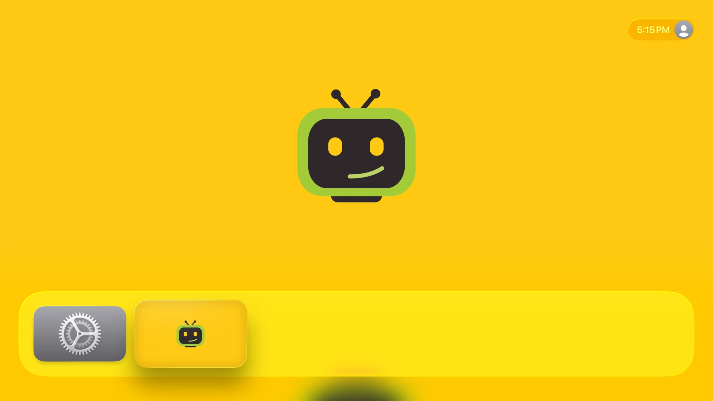
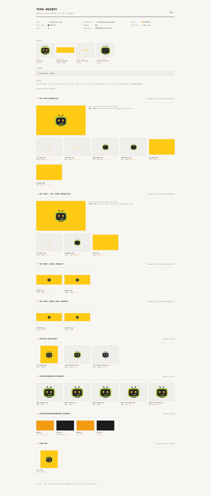
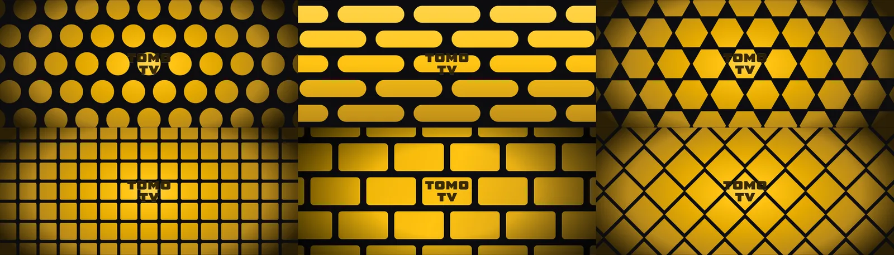

# tvos-assets

Generate app icons, Top Shelf images, splash screens and App Store listing art for Apple TV and iOS apps, from your icon art, a background and a color.

tvos-assets writes the `Images.xcassets` catalog Xcode expects: tvOS parallax app icons (home screen and App Store), both Top Shelf images, the iOS app icon with its dark and tinted variants, and the splash screen logo and color. With `--app-store` it also writes the iOS 27 and iPadOS 27 [App Store creative assets](#app-store-creative-assets): header, search results, universal and In-App Event images, plus looping videos.

Run it as a CLI, from Node, or as an [Expo config plugin](#expo-config-plugin) on every `expo prebuild`.

<p align="center">
  
</p>

## Quick start

```bash
npx tvos-assets --icon ./icon.png --background ./bg.png --color "#F39C12"
```

That writes a timestamped zip to your Desktop:

| File | What it is |
|---|---|
| `Images.xcassets/` | 42 files: tvOS brand assets, the iOS app icon, the splash logo and color |
| `icon.png` | The flattened 1024x1024 icon |
| `preview.html` | A contact sheet of everything generated. Open it first: see [preview.html](#previewhtml) |

Each run gets its own zip, so nothing is overwritten.

## Install

```bash
npm install --save-dev tvos-assets   # in a project, for scripts or the Expo plugin
npm install -g tvos-assets           # global CLI
npx tvos-assets --help               # no install
```

Needs Node.js 18 or later. [sharp](https://sharp.pixelplumbing.com/install) installs with it. App Store videos also need [ffmpeg](https://ffmpeg.org) on `PATH` (or at `FFMPEG_PATH`).

## Usage

```bash
tvos-assets --icon <path> --background <path> --color <hex> [options]
```

Inputs can come from flags or from a config file. With a `tvos-assets.config.json` in the current directory, the command is just `tvos-assets`; `tvos-assets --init` writes a starter one.

Later sources win:

```
built-in defaults  ->  config file  ->  --set  ->  named flags  ->  --icon / --background / --color
```

By default the output is a zip in `~/Desktop` (or `~` without a Desktop). `--out-dir` writes `Images.xcassets/` and `icon.png` straight into a folder instead; folders tvos-assets owns are rewritten and everything else in the catalog is left alone.

SVG inputs are rasterized at the density each size needs, so a small viewBox still makes a sharp 4K Top Shelf image.

## Options

**Config key** is the path in `tvos-assets.config.json`, and the path `--set` takes. **Plugin** is the [Expo plugin](#expo-config-plugin) prop; "via `config`" means the plugin reaches it through its `config` prop, a path to a JSON config file.

| Option | Config key | Plugin | Type | Default | Description |
|---|---|---|---|---|---|
| `--icon <path>` | `inputs.iconImage` | `icon` | path | required\* | Icon PNG or SVG on transparency. \*Not needed when `--layer-front` and `--layer-middle` are both given: the icon is [assembled from them](#assembling-the-icon-from-layer-art). |
| `--background <path>` | `inputs.backgroundImage` | `background` | path | required | Background PNG or SVG. |
| `--color <hex>` | `inputs.backgroundColor` | `color` | `#RRGGBB` | required | Splash background, light mode. |
| `--dark-color <hex>` | `inputs.darkBackgroundColor` | `darkColor` | `#RRGGBB` | derived | Splash background, dark mode. Derived from `--color` at half the HSL lightness. |
| `--icon-dark <path>` | `inputs.iconDarkImage` | `iconDark` | path | derived | iOS dark-appearance icon. |
| `--icon-tinted <path>` | `inputs.iconTintedImage` | `iconTinted` | path | derived | iOS tinted-appearance icon. |
| `--icon-border-radius <px>` | `inputs.iconBorderRadius` | `iconBorderRadius` | number | `0` | Icon corner radius; half the icon width or more makes a circle. Not applied to custom layer art. |
| `--output <path>` | `output.directory` | fixed | path | `~/Desktop` | Where the zip goes, or the catalog in `dir` mode. |
| `--out-dir <path>` | `output.directory` | fixed | path | none | Write into this folder instead of a zip. Implies `--mode dir`. |
| `--mode <zip\|dir>` | `output.mode` | always `dir` | `zip` \| `dir` | `zip` | Output mode. |
| `--platforms <list>` | not a config key | `EXPO_TV=1` | `tvos`, `ios` | both | Icon families to write. Splash assets are written either way. |
| `--preview` / `--no-preview` | not a config key | not written | boolean | on | Write `preview.html`. |
| `--brand-name <name>` | `brandAssets.name` | via `config` | string | `AppIcon` | The `.brandassets` name. Must match `ASSETCATALOG_COMPILER_APPICON_NAME` on the tvOS target. |
| `--set brandAssets.appIconSmall.enabled=` | `brandAssets.appIconSmall.enabled` | via `config` | boolean | `true` | Home screen imagestack on or off. |
| `--set brandAssets.appIconSmall.name=` | `brandAssets.appIconSmall.name` | via `config` | string | `App Icon` | Folder name. Must match `CFBundleIcons` > `CFBundlePrimaryIcon`. |
| `--set brandAssets.appIconSmall.size.width=` | `brandAssets.appIconSmall.size` | via `config` | `{width,height}` | `400x240` | Size in points, multiplied by each scale. |
| `--set brandAssets.appIconSmall.scales=` | `brandAssets.appIconSmall.scales` | via `config` | string[] | `1x,2x` | Scales to write. |
| `--set brandAssets.appIconLarge.*=` | `brandAssets.appIconLarge.*` | via `config` | same keys | `App Icon - App Store`, `1280x768`, `1x` | The App Store imagestack, same keys as `appIconSmall`. |
| `--ios-icon-scale <0-1>` | `iosIcon.iconScale` | `iosIconScale` | number | `0.8` | How much of the iOS icon the mark covers. See [Sizing the mark](#sizing-the-mark). |
| `--tv-icon-scale <0-1>` | `brandAssets.iconScale` | `tvIconScale` | number | `0.75` | How much of the shorter tvOS side the mark covers, on every imagestack and Top Shelf image. |
| `--layer-front`, `--layer-middle`, `--layer-back` | `brandAssets.<stack>.layers.<layer>.imagePath` | `layers` | path | icon, icon, background | Art per parallax layer; the flags apply to both imagestacks. See [Parallax layers](#parallax-layers). |
| `--set brandAssets.<stack>.layers.<layer>.source=` | `brandAssets.<stack>.layers.<layer>.source` | via `config` | `icon` \| `background` | front/middle `icon`, back `background` | `icon` is centred on transparency, `background` fills the layer. |
| `--no-top-shelf` | `brandAssets.topShelfImage(Wide).enabled` | via `config` | boolean | `true` | Both Top Shelf images on or off. |
| `--set brandAssets.topShelfImage.name=` | `brandAssets.topShelfImage(Wide).name` | via `config` | string | `Top Shelf Image` / `Top Shelf Image Wide` | Folder name. Must match the `TVTopShelfImage` keys in `Info.plist`. |
| `--set brandAssets.topShelfImage.size.width=` | `brandAssets.topShelfImage(Wide).size` | via `config` | `{width,height}` | `1920x720` / `2320x720` | Size in points. |
| `--set brandAssets.topShelfImage.scales=` | `brandAssets.topShelfImage(Wide).scales` | via `config` | string[] | `1x,2x` | Scales to write. |
| `--set brandAssets.topShelfImage.filePrefix=` | `brandAssets.topShelfImage(Wide).filePrefix` | via `config` | string | `top` / `wide` | File name prefix. |
| `--no-ios-icon` | `iosIcon.enabled` | via `config` | boolean | `true` | iOS `AppIcon.appiconset` on or off. |
| `--ios-icon-name <name>` | `iosIcon.name` | via `config` | string | `AppIcon` | The `.appiconset` name. Must match `ASSETCATALOG_COMPILER_APPICON_NAME` on the iOS target. |
| `--no-splash` | `splashScreen.logo.enabled`, `splashScreen.background.enabled` | via `config` | boolean | `true` | Splash logo and color on or off. |
| `--splash-logo-name <name>` | `splashScreen.logo.name` | via `config` | string | `SplashScreenLogo` | Imageset name. Must match your launch screen. |
| `--splash-logo-size <px>` | `splashScreen.logo.baseSize` | via `config` | number | `200` | Logo size in px, multiplied by each scale. |
| `--set splashScreen.logo.filePrefix=` | `splashScreen.logo.filePrefix` | via `config` | string | `200-icon` | File name prefix. |
| `--set splashScreen.logo.universal.scales=` | `splashScreen.logo.universal.scales` | via `config` | string[] | `1x,2x,3x` | Logo scales for iPhone and iPad. |
| `--set splashScreen.logo.tv.scales=` | `splashScreen.logo.tv.scales` | via `config` | string[] | `1x,2x` | Logo scales for Apple TV. |
| `--splash-background-name <name>` | `splashScreen.background.name` | via `config` | string | `SplashScreenBackground` | Colorset name. Must match your launch screen. |
| `--set splashScreen.background.tv.dark=` | `splashScreen.background.{universal,tv}.{light,dark}` | via `config` | `#RRGGBB` | `--color` / `--dark-color` | Splash colors per device and appearance. |
| `--app-store` | `appStore.enabled` | `appStore` | boolean | `false` | Write the [App Store creative assets](#app-store-creative-assets) into `AppStore/` (plugin: `appStore.outDir`). |
| `--app-store-background <path>` | `appStore.backgroundImage` | `appStore.background` | path | `--background` | Backdrop for the App Store images. |
| `--app-store-center <path>` | `appStore.centerImage` | `appStore.centerImage` | path | the icon | Art centred in each safe area, such as a wordmark. |
| `--set appStore.iconScale=` | `appStore.iconScale` | `appStore.iconScale` | number | `0.8` | How much of each safe area the centred art covers. |
| `--set appStore.header.source=` | `appStore.<placement>.source` | same keys | path | none | Finished art (SVG or PNG) for a placement. Required for `eventCard` and `eventDetails`. See [Row artwork](#row-artwork). |
| `--set appStore.header.animate.rows=20` | `appStore.<placement>.animate` | same keys | `{ rows: seconds }` | none | A looping video from row artwork: 5-30 s, or 15-30 s for In-App Events. Not for `universal`. |
| `--set appStore.searchResults.video=` | `appStore.<placement>.video` | same keys | path | none | A [recording](#recordings) cut into the placement's looping video. Not for `universal`. |
| `--set appStore.universal.enabled=false` | `appStore.<placement>.enabled` | same keys | boolean | on; In-App Events off | Write a placement or skip it: `header`, `searchResults`, `universal`, `eventCard`, `eventDetails`. |
| `--set appStore.searchResults.center=false` | `appStore.<placement>.{backgroundImage,centerImage,center}` | same keys | per placement | `center: true` | Per-placement backdrop and centred art; `center: false` writes the backdrop alone. |
| `--set appStore.video.fps=60` | `appStore.video.fps`, `appStore.video.codec` | same keys | `30`\|`60`, `h264`\|`prores` | `30`, `h264` | Video frame rate and codec. |
| `--set appStore.video.audio=` | `appStore.video.audio` | same key | path | none | [Music](#music) on every video, looped with a 1 s crossfade. Silent without it. |
| `--set appStore.video.audioStart=` | `appStore.video.audioStart`, `appStore.video.audioEnd` | same keys | seconds | first sound, end of track | The part of the track the loop is picked from. |
| `--set xcassetsMeta.author=` | `xcassetsMeta.author`, `xcassetsMeta.version` | via `config` | string, integer | `xcode`, `1` | Written into every `Contents.json`. |
| `--config <path>` | n/a | `config` | path | `./tvos-assets.config.json` if present | Config file. |
| `--set <path=value>` | n/a | n/a | repeatable | none | Set any config key. See below. |
| `--dry-run` | n/a | n/a | flag | off | List what would be written, then exit. |
| `--print-config` | n/a | n/a | flag | off | Print the merged config as JSON, then exit. |
| `--init [path]` | n/a | n/a | flag | off | Write a starter config with `$schema` set, then exit. Never overwrites. |
| `--quiet` | n/a | n/a | flag | off | Print only errors and the output path. |
| `--version`, `--help` | n/a | n/a | flag | off | Version; help with a `--set` cheatsheet. |

### Setting any key with `--set`

Every config key is reachable from the command line. Values take the key's type (`true`/`false`, numbers, comma-separated lists):

```bash
tvos-assets --icon icon.svg --background bg.png --color "#1C1C1E" \
  --set brandAssets.appIconSmall.size.width=500 \
  --set brandAssets.appIconLarge.enabled=false \
  --set splashScreen.background.tv.dark=#000000
```

A misspelled path fails and lists the keys that exist at that level. `--print-config` shows what a mix of config file, `--set` and flags resolves to.

## preview.html

Every run writes a `preview.html` beside your assets. Open it to check the whole catalog in a browser before you touch Xcode.

<p align="center">
  
</p>

It's one file with every image embedded, so it works offline and can go straight to a designer. It shows:

- **Where everything came from**: each input with its role, the exact command, and the merged config. Paths are relative or start with `~`, so a shared page never exposes your machine's paths.
- **Every generated file** with its real name and pixel size, transparency on a checkerboard, and the splash colors as light and dark swatches. Click a thumbnail to open the full-size file.
- **Live parallax**: point at an imagestack and its layers separate the way tvOS moves them on focus.
- **The App Store assets** with `--app-store`: each image with its safe area outlined, and the videos playing (they're too big to embed, so they play from the files beside the page).

[`examples/tomotv/output/preview.html`](examples/tomotv/output/preview.html) is a real one, from the TomoTV app.

With `--out-dir` it's written beside `Images.xcassets`, so Xcode never compiles it in. `--no-preview` skips it.

## Expo config plugin

Regenerate everything on each `expo prebuild`, for tvOS (`EXPO_TV=1`) and iOS:

```json
"plugins": [
  ["tvos-assets/plugin", {
    "background": "./assets/brand/background.png",
    "color": "#1C1C1E",
    "layers": { "front": "./assets/brand/layer-front.svg", "middle": "./assets/brand/layer-middle.svg" }
  }]
]
```

There's no `icon` prop here: with art for both layers, the plugin assembles the icon. Props are the **Plugin** column of the [options table](#options), with paths relative to the project root. Anything else goes through `config`, a JSON config file merged under the props.

Install it as a dev dependency (`npm i -D tvos-assets`) and list it **after** `expo-splash-screen` and any TV config plugin (such as `@react-native-tvos/config-tv`), so its splash assets win.

- `EXPO_TV=1 expo prebuild` writes `AppIcon.brandassets` (both imagestacks and both Top Shelf images) into `ios/<project>/Images.xcassets/` and sets the tvOS `Info.plist` icon and Top Shelf keys.
- `expo prebuild` writes the iOS `AppIcon.appiconset` with its light, dark and tinted icons.
- Both write the splash logo and color.
- With an `appStore` prop, both also write the App Store assets into its `outDir` (default `./AppStore`), outside `ios/`, so prebuild never wipes them. Only files whose inputs changed are rendered again.

```json
"appStore": {
  "outDir": "./AppStore",
  "header": { "source": "./store/artwork.svg", "animate": { "rows": 20 } },
  "searchResults": { "source": "./store/artwork.svg", "animate": { "rows": 20 } },
  "universal": { "source": "./store/artwork.svg" },
  "video": { "audio": "./store/music.mp3" }
}
```

Each prebuild rewrites the folders it owns (`AppIcon.brandassets`, `AppIcon.appiconset`, `SplashScreenLogo.imageset`, `SplashScreenBackground.colorset`) and leaves the rest of the catalog alone. To change your icon, replace the source files and run prebuild.

`@expo/config-plugins` is an optional peer dependency; the plugin uses your app's copy, and works when tvos-assets is linked with `file:` or `link:`.

## App icons

### iOS light, dark and tinted (iOS 18+)

`AppIcon.appiconset` holds three 1024x1024 icons:

- **Light**: the icon on the background, opaque.
- **Dark**: the icon on transparency (`--icon-dark`, or derived); iOS draws the dark backdrop.
- **Tinted**: a grayscale icon on transparency (`--icon-tinted`, or derived); iOS applies the user's tint.

The derived ones suit most marks. Supply your own when the icon loses contrast in grayscale or needs a brighter dark version.

### Parallax layers

By default the Front and Middle layers of each tvOS imagestack both show the whole icon, and Back shows the background. For real depth, give each layer its own art:

```bash
tvos-assets --icon icon.svg --background bg.png --color "#1C1C1E" \
  --layer-front ./layer-front.svg --layer-middle ./layer-middle.svg
```

Or per stack in the config file (`brandAssets.<stack>.layers.<layer>.imagePath`), or with the plugin's `layers` prop. Export every layer from the **same square artboard** as the icon and they stay aligned: every layer gets the same placement and scale. A common split is highlights on Front, the main shape on Middle, and the background on Back. Point at the imagestack in `preview.html` to check the depth before you build.

### Sizing the mark

The scale applies to your visible artwork, not to the artboard around it. tvos-assets first trims the icon to the square its artwork fills, so `--ios-icon-scale 0.8` means the mark covers 80% of the icon whatever padding your file has.

| | Default | Why |
| --- | --- | --- |
| `--ios-icon-scale` | `0.8` | Apple's icon grid puts the main shape at about 80% of the canvas. |
| `--tv-icon-scale` | `0.75` | tvOS wants a 10-15% safe margin on each layer, because a focused icon grows and its layers shift. 0.75 leaves 12.5% a side. |

One trim box is measured per run and used for every size and every layer, which keeps the layers registered. The splash logo isn't affected.

### Assembling the icon from layer art

When both the Front and Middle layers have their own art, `--icon` is optional: the icon is built from those layers, back to front, and used everywhere a flat icon is needed (iOS icon, Top Shelf, splash logo, `icon.png`).

```bash
tvos-assets --background bg.png --color "#1C1C1E" \
  --layer-front ./layer-front.svg --layer-middle ./layer-middle.svg
```

- Both layers need art; with only `--layer-front`, `--icon` is still required.
- When the two imagestacks have different art, the App Store one (`appIconLarge`) is used.
- `iconBorderRadius` applies to the assembled icon.

## App Store creative assets

With `--app-store`, tvos-assets also writes the creative assets App Store Connect takes for iOS 27 and iPadOS 27 apps into `AppStore/`:

| Placement | Image | Video | Default |
|---|---|---|---|
| Product page header | `header.png` 3840x1646 | `header.mp4`, 5-30 s | on |
| Search results | `search-results.png` 3840x2560 | `search-results.mp4`, 5-30 s | on |
| Universal (header and search results in one) | `universal.png` 5244x2950 | none | on |
| In-App Event card | `event-card.png` 3840x2160 | `event-card.mp4`, 15-30 s | off, needs `source` |
| In-App Event details | `event-details.png` 2160x3840 | `event-details.mp4`, 15-30 s | off, needs `source` |

Each placement in App Store Connect takes one image or one video. Images are opaque PNGs. Videos are written when a placement has `animate` or a recording.

Out of the box, each image is your backdrop (`--app-store-background`, else `--background`) with the icon, or `--app-store-center` art such as a wordmark, centred in the safe area from Apple's templates. Each placement can have its own:

```json
"appStore": {
  "enabled": true,
  "backgroundImage": "./brand/scene.png",
  "centerImage": "./brand/wordmark.svg",
  "searchResults": { "backgroundImage": "./shots/library.png", "center": false }
}
```

Apple publishes no safe area for In-App Event media, so those two need a `source`.

### Row artwork

Give a placement a `source` (SVG or PNG) to use finished art instead. A **row artwork** SVG goes further: a wall of repeated cards (a Figma or Sketch export, say) that tvos-assets re-tiles to every canvas, so one file serves every placement, and that `animate` turns into a looping video where the rows slide one card per loop in alternating directions.

```json
"appStore": {
  "enabled": true,
  "header": { "source": "./store/artwork.svg", "animate": { "rows": 20 } },
  "searchResults": { "source": "./store/artwork.svg", "animate": { "rows": 20 } },
  "universal": { "source": "./store/artwork.svg" }
}
```

That writes `header.png` and `header.mp4`, `search-results.png` and `search-results.mp4`, and `universal.png`. The art is centred in each safe area; if the card under your logo wouldn't fit one whole, the art shifts until it does. A record in `.tvos-assets-store.json` skips files whose inputs haven't changed, so videos only render again when the art or settings change.

What moves and what stays:

- **Drawn through the mask** (the fill behind the cards, type seen through them): stays put while the cards slide over it.
- **Drawn on top, inside one card** (a live dot, say): rides with that card. A row moves one card per loop, so in the last half second it hands over to the next card and the loop closes.
- **Everything else drawn on top** (a vignette, a logo across cards, anything in a transformed group): stays put.
- **Texture that should move with the cards**, such as scan lines: put it in the cards' fill as a `pattern` with `patternUnits="userSpaceOnUse"`.

Design at 3840x1646 (the header) and export SVG. Each rule is checked, and a file that breaks one fails with a message naming it:

| Rule | Why |
|---|---|
| `<svg>` has numeric `width` and `height` in px | Everything is measured against them. |
| Exactly one `<mask>`, used by the fill behind the cards (`mask="url(#id)"`) | The mask's children are the cards. |
| Cards are `path`, `rect`, `circle`, `ellipse` or `polygon`: at least two, all one size, no `transform` | Each row is redrawn from one card; flatten transforms before export. |
| Cards in a row are evenly spaced, the same spacing in every row | That spacing is how far a row slides per loop. |
| Rows are evenly spaced and repeat every two (row 3 lines up with row 1) | Extra rows on taller canvases continue the pattern. |
| Full-canvas fills cover exactly 0,0 to width,height | Those stretch to bigger canvases; everything else stays centred. |
| No `<text>`, and no `<image>` linking outside the file | Outline text and embed images so every machine renders the same. |
| A shape may hold one `<animate attributeName values dur>` whose `dur` divides the loop | Videos play it; stills show its first value. |

[`examples/row-artwork/`](examples/row-artwork) has six files that pass, one per card shape: circles, rounded rects, hexagons, path tiles, 16:9 screens under a vignette, and diamonds.



Row-motion videos are fast: only the cards move, so each frame is blended from layers drawn once, several frames at a time. A 20 s 4K header takes about 30 s on an M1 Max. Art the blend can't reproduce exactly is drawn in full each frame instead.

### Recordings

Point `header.video` or `searchResults.video` at a recording (`.mov`, `.mp4` or `.m4v`), such as a simulator capture (`xcrun simctl io <udid> recordVideo`) of a tour that ends where it starts. tvos-assets fits it to the canvas, keeps a constant frame rate, blends the last 0.5 s into the start so the loop has no cut, and caps it at 30 s.

```json
"appStore": { "enabled": true, "searchResults": { "video": "./store/tour.mov" } }
```

Videos are H.264 High (libx264, steady quality across the loop point) with AAC audio, or ProRes 422 HQ in `.mov` with `video.codec: "prores"` (VideoToolbox on a Mac).

### Music

`video.audio` adds music (`.mp3`, `.m4a`, `.aac`, `.wav` or `.aiff`) to every video, looped so it never cuts: the last second crossfades into the first. The loop is picked from the part of the track between `video.audioStart` and `video.audioEnd` (by default from the first sound to the end), where the beat lines up across the loop and the level never drops out.

```json
"appStore": { "enabled": true, "video": { "audio": "./store/music.mp3", "audioStart": 30, "audioEnd": 90 } }
```

App Store videos play muted; people can unmute the product page header, but not search results.

Upload the files in App Store Connect under Header and Search Results, or to the Asset Library.

## Programmatic API

```js
import { resolveConfig, generateAssets, planAssets } from "tvos-assets";

const config = resolveConfig({
  icon: "./icon.svg",              // the same inputs as the CLI flags
  background: "./bg.png",
  color: "#1C1C1E",
  config: "./assets.config.json",  // optional, like --config
  overrides: { appStore: { enabled: true } }, // optional, like --set
});

// Count what a run would write, without writing it.
const plan = planAssets(config, { platforms: ["ios"] });
console.log(plan.total, plan.directories);

const { warnings } = await generateAssets(config, "./out/Images.xcassets", {
  platforms: ["tvos", "ios"],             // default: both
  standaloneIconPath: "./out/icon.png",   // optional flat icon
  previewPath: "./out/preview.html",      // optional contact sheet
  appStoreDir: "./out/AppStore",          // where App Store assets go
  onStep: (message) => console.log(message),
});
```

`generateAssets` writes into the catalog folder (creating it if needed) and resolves to `{ warnings, xcassetsDir }`. `resolveConfig` throws on bad input (missing files, bad colors, wrong formats). Also exported: `discoverConfigPath`, `configShapeTemplate`, `CONFIG_FILENAME` and `validateInputImages`.

## Examples

```bash
# A dark mode color and a circular icon
tvos-assets --icon ./icon.png --background ./bg.png --color "#F39C12" \
  --dark-color "#7A4E09" --icon-border-radius 512

# Straight into an Xcode project, tvOS only
tvos-assets --icon ./icon.svg --background ./bg.png --color "#1C1C1E" \
  --out-dir ios/MyApp --platforms tvos --brand-name AppIconTV

# Start a config file, then run with no flags
tvos-assets --init && tvos-assets

# See what a run would do
tvos-assets --config ./brand.json --dry-run
tvos-assets --config ./brand.json --print-config
```

[`examples/tomotv`](examples/tomotv) is a complete real project: TomoTV's art and config, with everything it generates committed.

## Input requirements

- **Icon**: PNG or SVG on transparency, at least 1024x1024 if raster. Its size on each output is set by `--ios-icon-scale` and `--tv-icon-scale`.
- **Background**: PNG or SVG, cover-fit and centre-cropped. At least 2320x720 if raster; 4640x1440 (Top Shelf @2x) avoids upscaling, and anything smaller gets a warning.
- **Color**: `#RRGGBB`.

SVGs are exempt from the minimums. You also get a warning for inputs over 50 MB, over 8192 px on a side, or a non-square icon.

## Wiring the assets up in Xcode

Generated names have to match what your project references. The defaults fit a stock Expo or React Native tvOS project; if you rename something, change it in both places.

| Generated | Referenced by | Default |
|---|---|---|
| `<name>.brandassets` | `ASSETCATALOG_COMPILER_APPICON_NAME` on the tvOS target | `AppIcon` |
| `<name>.appiconset` | `ASSETCATALOG_COMPILER_APPICON_NAME` on the iOS target | `AppIcon` |
| App Icon imagestack | `CFBundleIcons` > `CFBundlePrimaryIcon` in the tvOS `Info.plist` | `App Icon` |
| Top Shelf Image | `TVTopShelfImage` > `TVTopShelfPrimaryImage` | `Top Shelf Image` |
| Top Shelf Image Wide | `TVTopShelfImage` > `TVTopShelfPrimaryImageWide` | `Top Shelf Image Wide` |
| Splash logo imageset | Your launch screen's image view | `SplashScreenLogo` |
| Splash colorset | Your launch screen's background color | `SplashScreenBackground` |

The Expo plugin sets the `Info.plist` keys for you. In a plain Xcode project, set them yourself, add the generated `Images.xcassets` to your target (or write into the existing one with `--out-dir`), and check its target membership.

<details>
<summary><strong>Generated files</strong> (44 in a default run)</summary>

21 `Contents.json`, 21 PNGs, `icon.png` and `preview.html`:

```
tvos-assets-YYYYMMDD-HHmmss.zip
├── icon.png                                     (1024x1024, icon on background)
├── preview.html                                 (contact sheet)
└── Images.xcassets/
    ├── Contents.json
    ├── AppIcon.brandassets/
    │   ├── Contents.json
    │   ├── App Icon.imagestack/
    │   │   ├── Contents.json
    │   │   ├── Front.imagestacklayer/
    │   │   │   ├── Contents.json
    │   │   │   └── Content.imageset/
    │   │   │       ├── Contents.json
    │   │   │       ├── front@1x.png             (400x240)
    │   │   │       └── front@2x.png             (800x480)
    │   │   ├── Middle.imagestacklayer/
    │   │   │   ├── Contents.json
    │   │   │   └── Content.imageset/
    │   │   │       ├── Contents.json
    │   │   │       ├── middle@1x.png            (400x240)
    │   │   │       └── middle@2x.png            (800x480)
    │   │   └── Back.imagestacklayer/
    │   │       ├── Contents.json
    │   │       └── Content.imageset/
    │   │           ├── Contents.json
    │   │           ├── back@1x.png              (400x240, opaque)
    │   │           └── back@2x.png              (800x480, opaque)
    │   ├── App Icon - App Store.imagestack/
    │   │   ├── Contents.json
    │   │   ├── Front.imagestacklayer/…/front@1x.png    (1280x768)
    │   │   ├── Middle.imagestacklayer/…/middle@1x.png  (1280x768)
    │   │   └── Back.imagestacklayer/…/back.png         (1280x768, opaque)
    │   ├── Top Shelf Image.imageset/
    │   │   ├── Contents.json
    │   │   ├── top@1x.png                       (1920x720, opaque)
    │   │   └── top@2x.png                       (3840x1440, opaque)
    │   └── Top Shelf Image Wide.imageset/
    │       ├── Contents.json
    │       ├── wide@1x.png                      (2320x720, opaque)
    │       └── wide@2x.png                      (4640x1440, opaque)
    ├── AppIcon.appiconset/
    │   ├── Contents.json
    │   ├── icon-1024.png                        (1024x1024, opaque, light)
    │   ├── icon-1024-dark.png                   (1024x1024, transparent, dark)
    │   └── icon-1024-tinted.png                 (1024x1024, grayscale, tinted)
    ├── SplashScreenLogo.imageset/
    │   ├── Contents.json
    │   ├── 200-icon@1x.png                      (200px)
    │   ├── 200-icon@2x.png                      (400px)
    │   ├── 200-icon@3x.png                      (600px)
    │   ├── 200-icon-tv@1x.png                   (200px, tv)
    │   └── 200-icon-tv@2x.png                   (400px, tv)
    └── SplashScreenBackground.colorset/
        └── Contents.json                        (light and dark colors)
```

Front and Middle are the icon on transparency; Back and the Top Shelf images are opaque, as tvOS requires. `--platforms ios` drops `AppIcon.brandassets`, `--platforms tvos` drops `AppIcon.appiconset`, and `--no-splash` drops the splash assets. `--dry-run` lists the exact set.

</details>

## Configuration file

Every section is optional. Name the file `tvos-assets.config.json` in your project root and the CLI finds it. Keys and defaults are in the [options table](#options); [`examples/tvos-assets.config.json`](examples/tvos-assets.config.json) is a complete annotated example.

```json
{
  "$schema": "./node_modules/tvos-assets/schema.json",
  "inputs": {
    "iconImage": "./icon.png",
    "backgroundImage": "./background.png",
    "backgroundColor": "#B43939"
  }
}
```

`tvos-assets --init` writes this for you, with `$schema` set for autocompletion and validation in your editor.

<details>
<summary><strong>Every key</strong></summary>

```json
{
  "$schema": "./node_modules/tvos-assets/schema.json",
  "inputs": {
    "iconImage": "./icon.png",
    "backgroundImage": "./background.png",
    "backgroundColor": "#B43939",
    "darkBackgroundColor": "#5A1C1C",
    "iconBorderRadius": 80,
    "iconDarkImage": "./icon-dark.svg",
    "iconTintedImage": "./icon-tinted.svg"
  },
  "output": {
    "directory": "./output",
    "mode": "zip"
  },
  "brandAssets": {
    "name": "AppIcon",
    "iconScale": 0.75,
    "appIconSmall": {
      "enabled": true,
      "name": "App Icon",
      "size": { "width": 400, "height": 240 },
      "scales": ["1x", "2x"],
      "layers": {
        "front": { "source": "icon", "imagePath": "./layer-front.svg" },
        "middle": { "source": "icon", "imagePath": "./layer-middle.svg" },
        "back": { "source": "background" }
      }
    },
    "appIconLarge": {
      "enabled": true,
      "name": "App Icon - App Store",
      "size": { "width": 1280, "height": 768 },
      "scales": ["1x"],
      "layers": {
        "front": { "source": "icon" },
        "middle": { "source": "icon" },
        "back": { "source": "background" }
      }
    },
    "topShelfImage": {
      "enabled": true,
      "name": "Top Shelf Image",
      "size": { "width": 1920, "height": 720 },
      "scales": ["1x", "2x"],
      "filePrefix": "top"
    },
    "topShelfImageWide": {
      "enabled": true,
      "name": "Top Shelf Image Wide",
      "size": { "width": 2320, "height": 720 },
      "scales": ["1x", "2x"],
      "filePrefix": "wide"
    }
  },
  "iosIcon": {
    "enabled": true,
    "name": "AppIcon",
    "iconScale": 0.8
  },
  "splashScreen": {
    "logo": {
      "enabled": true,
      "name": "SplashScreenLogo",
      "baseSize": 200,
      "filePrefix": "200-icon",
      "universal": { "scales": ["1x", "2x", "3x"] },
      "tv": { "scales": ["1x", "2x"] }
    },
    "background": {
      "enabled": true,
      "name": "SplashScreenBackground",
      "universal": { "light": "#B43939", "dark": "#5A1C1C" },
      "tv": { "light": "#B43939", "dark": "#5A1C1C" }
    }
  },
  "appStore": {
    "enabled": true,
    "iconScale": 0.8,
    "backgroundImage": "./store-bg.png",
    "centerImage": "./wordmark.svg",
    "header": { "enabled": true, "center": true, "source": "./artwork.svg", "animate": { "rows": 20 } },
    "searchResults": { "enabled": true, "center": true, "video": "./tour.mov" },
    "universal": { "enabled": true, "center": true },
    "eventCard": { "enabled": false, "center": true },
    "eventDetails": { "enabled": false, "center": true },
    "video": { "fps": 30, "codec": "h264", "audio": "./music.mp3", "audioStart": 30, "audioEnd": 90 }
  },
  "xcassetsMeta": {
    "author": "xcode",
    "version": 1
  }
}
```

</details>

### About `$schema`

`schema.json` ships in the package, so `$schema` always points at a local file: it matches the version you installed and works offline. `--init` picks the path for how you installed tvos-assets:

| Installed as | `$schema` | Why |
|---|---|---|
| Project dependency | `./node_modules/tvos-assets/schema.json` | Works for everyone who clones the repo and follows upgrades. In a monorepo it walks up to find it. |
| Global or `npx` | `./tvos-assets.schema.json` | There's no stable local copy, so `--init` copies the schema next to your config. |

The tool itself never reads `$schema`; it's for your editor.

## CI and build scripts

`--quiet` prints only errors and the output path:

```json
"scripts": {
  "icons": "tvos-assets --out-dir ios/MyApp --quiet --no-preview"
}
```

With a config file in the repo, the script needs no input flags. Commit the config and the source art, not the generated catalog.

To check a config without writing anything:

```bash
tvos-assets --print-config > /dev/null   # fails on an invalid config
tvos-assets --dry-run                    # lists what would be written
```

In Expo projects, use the [config plugin](#expo-config-plugin) instead: it runs inside `expo prebuild` and sets the `Info.plist` keys.

<details>
<summary><strong>Troubleshooting</strong></summary>

**"Icon image is too small."** Raster icons need 1024x1024. Export a bigger PNG or use an SVG.

**Top Shelf looks soft.** Top Shelf Wide @2x is 4640x1440; a smaller background gets upscaled. Use a bigger background or an SVG.

**A config value seems ignored.** Run `tvos-assets --print-config`. The config file loses to `--set`, which loses to named flags, which lose to `--icon`, `--background` and `--color`.

**A `--set` path is rejected.** The path doesn't exist; the error lists the keys that do.

**Xcode doesn't show the icon.** The bundle name must match `ASSETCATALOG_COMPILER_APPICON_NAME` on that target, and the catalog must be in the target. See [Wiring the assets up in Xcode](#wiring-the-assets-up-in-xcode).

**Prebuild overwrites the splash assets.** List `tvos-assets/plugin` after `expo-splash-screen` and any TV config plugin; the last plugin wins.

**The plugin made iOS icons instead of tvOS ones.** Run `EXPO_TV=1 expo prebuild`.

**App Store videos fail.** Install ffmpeg (`brew install ffmpeg`) or set `FFMPEG_PATH`.

**sharp fails to install.** See the [sharp installation guide](https://sharp.pixelplumbing.com/install).

**The output folder isn't writable.** It's checked before any work starts; check the permissions of its nearest existing parent.

</details>

## Development

```bash
git clone https://github.com/keiver/tvos-assets.git && cd tvos-assets && npm install
```

| Script | What it does |
|---|---|
| `npm run dev` | Run from the TypeScript source |
| `npm run build` | Compile to `dist/` |
| `npm start` | Run the compiled build |
| `npm test` | Run the tests |
| `npm run test:coverage` | Tests with coverage |

`dist/` isn't committed; `prepare` builds it on install, before publishing, and for git installs (`npm i github:keiver/tvos-assets`).

<details>
<summary>Testing a change the way users get it</summary>

Install the packed tarball into a scratch project, which checks `files`, `exports` and `bin`:

```bash
npm pack --pack-destination /tmp/consumer
cd /tmp/consumer && npm init -y && npm i ./tvos-assets-*.tgz

npx tvos-assets --version                                            # bin
node -e 'import("tvos-assets").then(m => console.log(Object.keys(m)))' # ESM library
node -e 'console.log(typeof require("tvos-assets/plugin"))'           # CJS plugin
```

`file:` and `link:` installs don't run `prepare`, so build first when testing the plugin from a linked checkout.

</details>

## License

MIT. The demo icons and backgrounds in the screenshots come from the [poster generator on keiver.dev](https://keiver.dev/lab/poster-generator).


